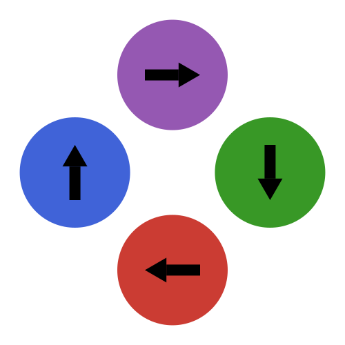

<table>
  <tr>
    <td></td>
    <td><h1>MicroMagnetic.jl</h1></td>
  </tr>
</table>

### **Previous name: JuMag.jl**
_A Julia package for classical spin dynamics and micromagnetic simulations with GPU support._

[](https://magneticsimulation.github.io/MicroMagnetic.jl/dev/)
[](https://magneticsimulation.github.io/MicroMagnetic.jl/stable/)
[](https://github.com/magneticsimulation/MicroMagnetic.jl/actions)
[](https://codecov.io/github/magneticsimulation/MicroMagnetic.jl)
[](https://doi.org/10.1088/1674-1056/ad766f)

### Features

- Supports classical spin dynamics and micromagnetic simulations.
- Compatible with CPU and multiple GPU platforms, including NVIDIA, AMD, Intel, and Apple GPUs.
- Supports both double and single precision.
- Supports Monte Carlo simulations for atomistic models.
- Implements the Nudged-Elastic-Band method for energy barrier computations.
- Supports Spin-transfer torques, including Zhang-Li and Slonczewski models.
- Incorporates various energy terms and thermal fluctuations.
- Supports constructive solid geometry.
- Supports periodic boundary conditions.
- Easily extensible to add new features.

## Website
Access our complete web resources including documentation, tutorials and examples:

[](https://magneticsimulation.github.io/MicroMagnetic.jl/dev/)
[](https://magneticsimulation.github.io/MicroMagnetic.jl/stable/)  

#### Mirror Site 
[](https://ww1g11.gitlab.io/MicroMagnetic.jl/)  

## Installation

Install MicroMagnetic is straightforward as long as Julia (<http://julialang.org/downloads/>) is installed, and it is equally easy in Windows, Linux and Mac.  

In [Julia](http://julialang.org), packages can be easily installed with the Julia package manager.
From the Julia REPL, type ] to enter the Pkg REPL mode and run:

```julia
pkg> add MicroMagnetic
```

Or, equivalently:

```julia
julia> using Pkg;
julia> Pkg.add("MicroMagnetic")
```

To install the latest development version:
```julia
pkg> add MicroMagnetic#master
```


To enable GPU support, one has to install one of the following packages:

| GPU Manufacturer      | Julia Package                                      |
| :------------------:  | :-----------------------------------------------:  |
| NVIDIA                | [CUDA.jl](https://github.com/JuliaGPU/CUDA.jl)     |
| AMD                   | [AMDGPU.jl](https://github.com/JuliaGPU/AMDGPU.jl) |
| Intel                 | [oneAPI.jl](https://github.com/JuliaGPU/oneAPI.jl) |
| Apple                 | [Metal.jl](https://github.com/JuliaGPU/Metal.jl)   |

For example, we can install `CUDA` for NVIDIA GPUs:

```julia
pkg> add CUDA
```

Now we will see similar messages if we type `using MicroMagnetic`

```
julia> using MicroMagnetic
julia> using CUDA
Precompiling CUDAExt
  1 dependency successfully precompiled in 8 seconds. 383 already precompiled.
[ Info: Switch the backend to CUDA.CUDAKernels.CUDABackend(false, false)
```


## Quick start
Assuming we have a cylindrical FeGe sample with a diameter of 100 nm and a height of 40 nm, we want to know 
its magnetization distribution and the stray field around it. We can use the following script: 

```julia
using MicroMagnetic
@using_gpu() # Import available GPU packages such as CUDA, AMDGPU, oneAPI, or Metal

# Define simulation parameters
args = (
    task = "Relax", # Specify the type of simulation task
    mesh = FDMesh(nx=80, ny=80, nz=30, dx=2e-9, dy=2e-9, dz=2e-9), # Define the mesh grid
    shape = Cylinder(radius=50e-9, height=40e-9), # Define the shape 
    Ms = 3.87e5, # Set the saturation magnetization (A/m)
    A = 8.78e-12, # Set the exchange stiffness constant (J/m)
    D = 1.58e-3, # Set the Dzyaloshinskii-Moriya interaction constant (J/m^2)
    demag = true, # Enable demagnetization effects in the simulation
    m0 = (1,1,1), # Set the initial magnetization direction
    stopping_dmdt = 0.1 # Set the stopping criterion 
);

# Run the simulation with the specified parameters
sim = sim_with(args); 

# Save the magnetization and the stray field into vtk.
save_vtk(sim, "m_demag", fields=["demag"]) 
```
The magnetization and the stray field around the cylindrical sample are stored in `m.vts`, which can be opened using Paraview. 

## Running MicroMagnetic.jl from Python

Thanks to [PythonCall.jl](https://github.com/JuliaPy/PythonCall.jl), running MicroMagnetic.jl from Python is seamless.

Below is an example setup for **Standard Problem #4**:

```python
from juliacall import Main as jl
jl.seval("using MicroMagnetic")

# Define simulation parameters
args = {
    "name": "std4",
    "task_s": ["relax", "dynamics"],                   # List of tasks to perform
    "mesh": jl.FDMesh(nx=200, ny=50, nz=1, dx=2.5e-9, dy=2.5e-9, dz=3e-9),  # Julia FDMesh object
    "Ms": 8e5,                                         # Saturation magnetization (A/m)
    "A": 1.3e-11,                                      # Exchange stiffness constant (J/m)
    "demag": True,                                     # Enable demagnetization
    "m0": (1, 0.25, 0.1),                              # Initial magnetization vector
    "alpha": 0.02,                                     # Gilbert damping coefficient
    "steps": 100,                                      # Number of dynamic simulation steps
    "dt": 0.01 * jl.ns,                                # Time step size (0.01 ns)
    "stopping_dmdt": 0.01,                             # Stopping criterion for relaxation
    "dynamic_m_interval": 1,                           # Save magnetization at each step
    "H_s": [(0, 0, 0), (-24.6 * jl.mT, 4.3 * jl.mT, 0)]  # Sequence of applied magnetic fields
}

# Run the simulation
sim = jl.sim_with(**args)
```

## Questions and Contributions

If you have any questions about usage, please join the conversation on our [GitHub Discussions page](https://github.com/magneticsimulation/MicroMagnetic.jl/discussions). 

We greatly appreciate contributions, feature requests, and suggestions! If you encounter any issues or have ideas for improving MicroMagnetic.jl, feel free to open an issue on our [GitHub Issues page](https://github.com/magneticsimulation/MicroMagnetic.jl/issues).

## Citation

If you use MicroMagnetic.jl in your research,  please cite the following publication:

```
@article{Wang_2024,
    doi = {10.1088/1674-1056/ad766f},
    url = {https://dx.doi.org/10.1088/1674-1056/ad766f},
    year = {2024},
    month = {oct},
    publisher = {Chinese Physical Society and IOP Publishing Ltd},
    volume = {33},
    number = {10},
    pages = {107508},
    author = {Weiwei Wang and Boyao Lyu and Lingyao Kong and Hans Fangohr and Haifeng Du},
    title = {MicroMagnetic.jl: A Julia package for micromagnetic and atomistic simulations with GPU support},
    journal = {Chinese Physics B}
}
```

