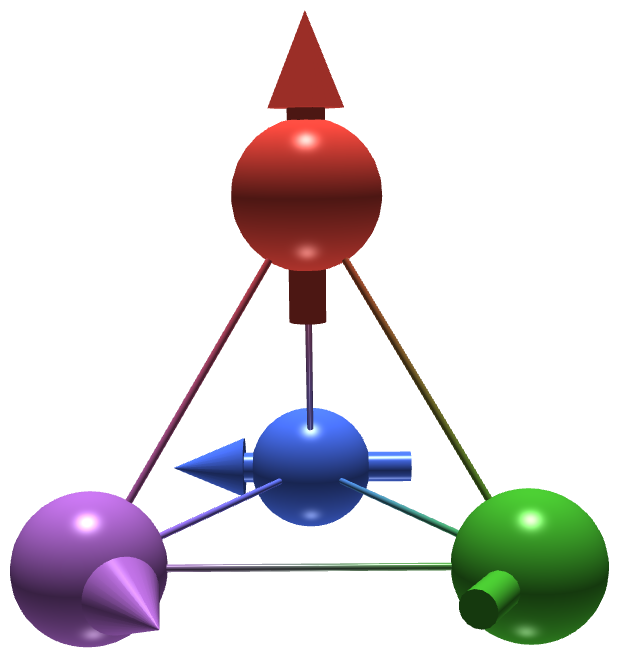

English | [简体中文](README_zh.md)

<table>
  <tr>
    <td></td>
    <td><h1>MicroMagnetic.jl</h1></td>
  </tr>
</table>


### **曾用名:JuMag.jl**
_一个支持 GPU 的经典自旋动力学与微磁学模拟 Julia 包。_

[](https://magneticsimulation.github.io/MicroMagnetic.jl/zh/)
[](https://magneticsimulation.github.io/MicroMagnetic.jl/zh/)
[](https://github.com/magneticsimulation/MicroMagnetic.jl/actions)
[](https://codecov.io/github/magneticsimulation/MicroMagnetic.jl)
[](https://doi.org/10.1088/1674-1056/ad766f)

### 功能特性

- 支持经典自旋动力学与微磁学模拟(LLG、惯性 LLG 与能量最小化),内置自适应与定步长积分器。
- 支持原子模型的蒙特卡洛模拟。
- 实现 NEB(弹性带)方法计算能量势垒,并支持系统鞍点搜索与测地线 NEB 跃迁路径发现。
- 支持自旋转移矩(Zhang-Li、Slonczewski)与自旋轨道矩。
- 支持微磁本征模分析。
- 内置分析工具:斯格明子数(拓扑荷)、导引中心、LTEM 相位 / Fresnel 散焦像模拟(含倾斜样品)。
- 退磁场的真周期性边界条件(1D/2D/3D),根据网格自动选择求解器。
- 内置多种能量项与热涨落。
- 支持构造实体几何(CSG)。
- 兼容 CPU 与多种 GPU 平台,包括 NVIDIA、AMD、Intel 和 Apple GPU。
- 支持双精度与单精度计算。
- 提供交互式网页 GUI,可实时可视化磁化动力学过程。
- 易于扩展新功能。

## 网站
完整文档、教程与示例请访问:

[](https://magneticsimulation.github.io/MicroMagnetic.jl/zh/)

#### 镜像站点
[](https://magneticsimulation.gitlab.io/MicroMagnetic.jl/)

### QQ 交流群
我们建有 QQ 交流群,如有 MicroMagnetic.jl 相关问题,欢迎加入(QQ 群号:1065654259)。

## Docker / Singularity 快速上手

我们提供了预构建的[容器镜像](https://github.com/MagneticSimulation/MicroMagnetic.jl/pkgs/container/micromagnetic.jl):完整 CUDA 版(约 3.3 GB)与精简 CPU 版(约 1.5 GB)。两者都烘焙了系统镜像(sysimage),`using MicroMagnetic` 数秒即完成启动,GPU 核函数首次调用也无需 JIT 等待。详见[完整文档](https://magneticsimulation.github.io/MicroMagnetic.jl/zh/docker.html)。

## 安装

只要安装了 Julia(<http://julialang.org/downloads/>),安装 MicroMagnetic 非常简单,Windows、Linux 和 Mac 下的步骤完全一致。

在 [Julia](http://julialang.org) 中使用包管理器即可安装。在 Julia REPL 中输入 ] 进入 Pkg 模式,运行:

```julia
pkg> add MicroMagnetic
```

或者等价地:

```julia
julia> using Pkg;
julia> Pkg.add("MicroMagnetic")
```

安装最新开发版:

```julia
pkg> add MicroMagnetic#master
```


要启用 GPU 支持,需要安装以下包之一:

| GPU 厂商              | Julia 包                                           |
| :------------------:  | :-----------------------------------------------:  |
| NVIDIA                | [CUDA.jl](https://github.com/JuliaGPU/CUDA.jl)     |
| AMD                   | [AMDGPU.jl](https://github.com/JuliaGPU/AMDGPU.jl) |
| Intel                 | [oneAPI.jl](https://github.com/JuliaGPU/oneAPI.jl) |
| Apple                 | [Metal.jl](https://github.com/JuliaGPU/Metal.jl)   |

例如,NVIDIA GPU 可安装 `CUDA`:

```julia
pkg> add CUDA
```

输入 `using MicroMagnetic` 后会看到类似如下的信息:

```
julia> using MicroMagnetic
julia> using CUDA
Precompiling CUDAExt
  1 dependency successfully precompiled in 8 seconds. 383 already precompiled.
[ Info: Switch the backend to CUDA.CUDAKernels.CUDABackend(false, false)
```

## 快速上手 -- 标准问题 4

```julia
using MicroMagnetic
using CairoMakie

@using_gpu() # 导入可用的 GPU 包,如 CUDA、AMDGPU、oneAPI 或 Metal

mesh = FDMesh(; nx=200, ny=50, nz=1, dx=2.5e-9, dy=2.5e-9, dz=3e-9); # 定义离散化网格

sim = Sim(mesh; driver="SD", name="std4") # 创建模拟实例
set_Ms(sim, 8e5)        # 设置饱和磁化强度
add_exch(sim, 1.3e-11)  # 添加交换作用
add_demag(sim)          # 添加退磁场

init_m0(sim, (1, 0.25, 0.1))  # 初始化磁化
relax(sim; stopping_dmdt=0.01)  # 第一阶段:弛豫到 "S" 态

set_driver(sim; driver="LLG", alpha=0.02, gamma=2.211e5)
add_zeeman(sim, (-24.6mT, 4.3mT, 0))                # 第二阶段:施加外磁场
run_sim(sim; steps=100, dt=1e-11, save_m_every=1)   # 运行 100 步

ovf2movie("std4_LLG"; output="std4.mp4", component='x'); # 生成动画
```

## 问题与贡献

如果在使用中遇到问题,欢迎到我们的 [GitHub Discussions 页面](https://github.com/magneticsimulation/MicroMagnetic.jl/discussions)参与讨论。

我们非常欢迎贡献、功能请求和建议!如果你遇到任何问题,或有改进 MicroMagnetic.jl 的想法,请随时到 [GitHub Issues 页面](https://github.com/magneticsimulation/MicroMagnetic.jl/issues)提交。

## 引用

如果在研究中使用了 MicroMagnetic.jl,请引用以下文献:

```
@article{Wang_2024,
    doi = {10.1088/1674-1056/ad766f},
    url = {https://dx.doi.org/10.1088/1674-1056/ad766f},
    year = {2024},
    month = {oct},
    publisher = {Chinese Physical Society and IOP Publishing Ltd},
    volume = {33},
    number = {10},
    pages = {107508},
    author = {Weiwei Wang and Boyao Lyu and Lingyao Kong and Hans Fangohr and Haifeng Du},
    title = {MicroMagnetic.jl: A Julia package for micromagnetic and atomistic simulations with GPU support},
    journal = {Chinese Physics B}
}
```
