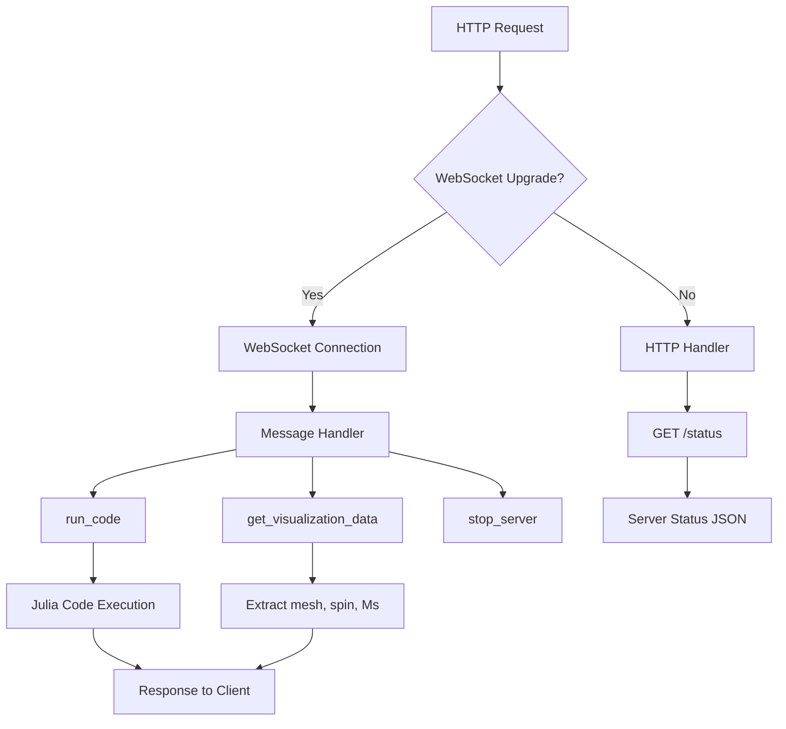
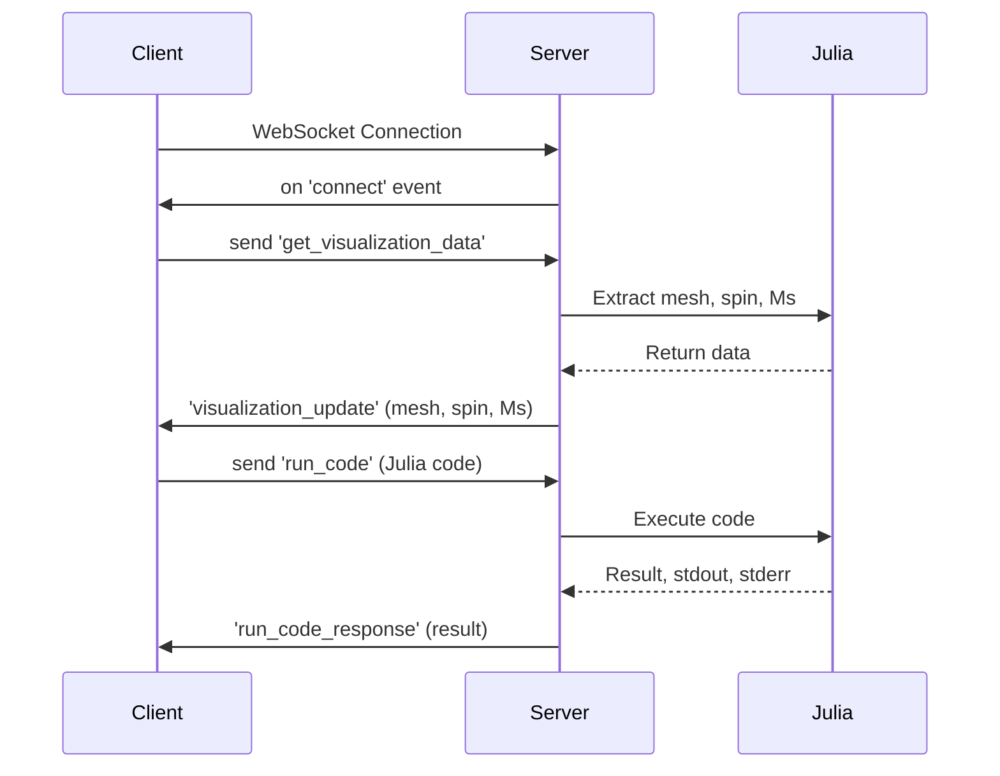
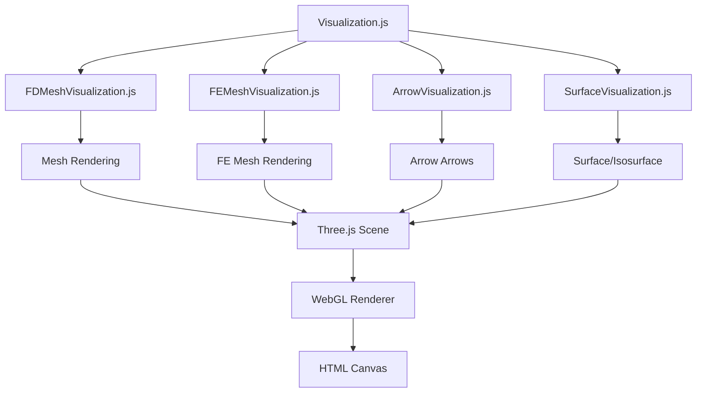
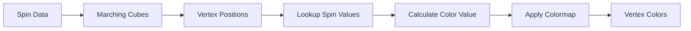
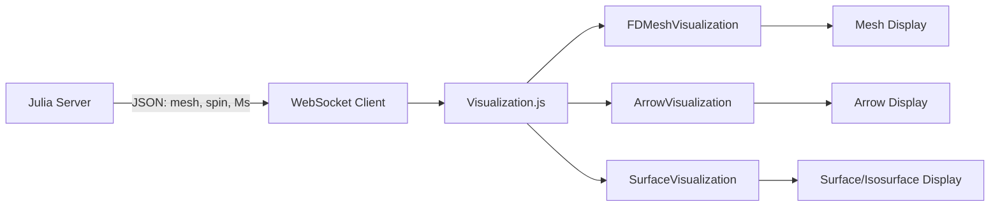
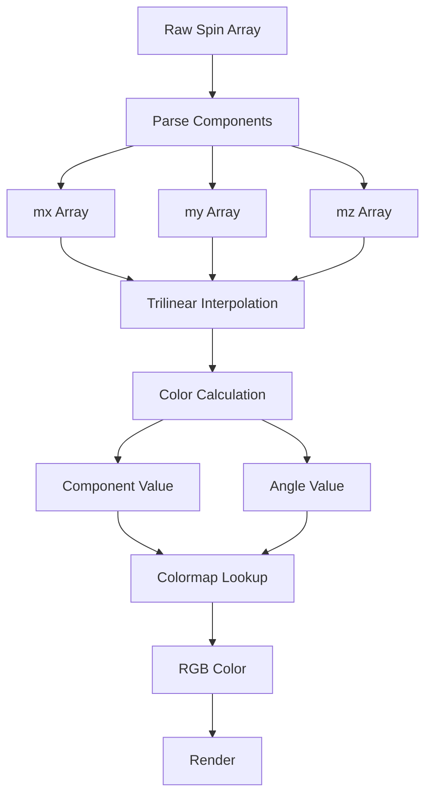

# API for developers

```@meta
CurrentModule = MicroMagnetic
```

## DataTypes
```@docs
MicroMagnetic.NumberOrArrayOrFunction
MicroMagnetic.NumberOrTupleOrArrayOrFunction
MicroMagnetic.NumberOrArray
MicroMagnetic.TupleOrArrayOrFunction
```

## Kernels
```@docs
atomistic_exchange_kernel!
atomistic_dmi_kernel!
```

## Server (server.jl)

### Overview
`server.jl` provides WebSocket server functionality for real-time communication with the frontend GUI.

### Main Functions

#### `start_server(;port, host, async, lan)`
Start the WebSocket server.

**Parameters:**
- `port::Int`: Server port (default: 10056)
- `host`: Server address (default: auto-detect)
- `async::Bool`: Whether to start asynchronously (default: true)
- `lan::Bool`: Whether to allow LAN access (default: true)

#### `gui(;port, host, lan)`
Start MicroMagnetic GUI (high-level interface).

**Parameters:**
- `port::Int`: Server port (default: 10056)
- `host::String`: Server address (default: "127.0.0.1")
- `lan::Bool`: Whether to allow LAN access (default: false)

### Architecture



### Message Handling
The server processes client requests through message handlers:

| Message Type | Description |
|-------------|-------------|
| `run_code` | Execute Julia code |
| `get_visualization_data` | Request visualization data (mesh, spin, Ms) |
| `stop_server` | Stop the server |

### Data Formats

#### Mesh Data (FD Mesh)
```julia
Dict(
    "type" => "fd",  # or "fe" for FEMesh
    "nx" => mesh.nx,
    "ny" => mesh.ny,
    "nz" => mesh.nz,
    "dx" => mesh.dx * 1e9,  # Convert to nm
    "dy" => mesh.dy * 1e9,
    "dz" => mesh.dz * 1e9
)
```

#### Mesh Data (FE Mesh)
```julia
Dict(
    "type" => "fe",
    "number_nodes" => mesh.number_nodes,
    "number_cells" => mesh.number_cells,
    "coordinates" => [[x1, y1, z1], [x2, y2, z2], ...],
    "cell_verts" => [[v1, v2, v3, v4], ...],  # 0-based indices
    "region_ids" => [region_id, ...]
)
```

#### Spin Data
```julia
# Data format: [mx, my, mz, mx, my, mz, ...] 3 components per position
Array(spin)
```

#### Ms Data
```julia
# Saturation magnetization array
Array(Ms)  # or Array(mu_s) for atomistic simulations
```

## Client (client.js)

### Overview
`client.js` is a WebSocket client for communication with the Julia server.

### Main Class: WebSocketClient

#### Constructor
```javascript
const client = new WebSocketClient({
    serverUrl: 'ws://localhost:10056',  // Optional, auto-detect
    sessionId: 'session_xxx'            // Optional, auto-generate
});
```

#### Common Methods

| Method | Description |
|--------|-------------|
| `connect()` | Connect to the server |
| `sendMessage(type, data)` | Send a message |
| `sendCommand(type, data)` | Send a command (with ID) |
| `on(event, callback)` | Add event listener |
| `off(event, callback)` | Remove event listener |
| `disconnect()` | Disconnect from server |

#### Event Types
- `connect`: Connection established
- `disconnect`: Connection closed
- `error`: Error occurred
- `visualization_update`: Visualization data received
- `run_code_response`: Code execution result
- `sim_state_update`: Simulation state update

### Flowchart



### Example
```javascript
const client = new WebSocketClient();

// Listen for visualization data
client.on('visualization_update', (data) => {
    console.log('Mesh:', data.mesh);
    console.log('Spin:', data.spin);
    console.log('Ms:', data.Ms);
});

// Listen for code execution results
client.on('run_code_response', (data) => {
    console.log('Success:', data.success);
    console.log('Output:', data.stdout);
});

// Send code for execution
client.sendMessage('run_code', { code: 'sim.mesh' });
```

## GUI Visualization

### Overview
The GUI uses Three.js for 3D visualization with multiple display modes.

### Component Architecture



### Main Components

#### FDMeshVisualization (FDMeshVisualization.js)
Displays Finite Difference (FD) mesh with visualization of cell boundaries.

#### FEMeshVisualization (FEMeshVisualization.js)
Displays Finite Element (FE) mesh with tetrahedral elements.

#### ArrowVisualization (ArrowVisualization.js)
Displays magnetization vector arrows at sampled positions.

**Sampling Modes:**
- `cartesian`: Cartesian coordinate sampling
- `cylindrical`: Cylindrical coordinate sampling

**Color Modes:**
- `mx`: X-component coloring
- `my`: Y-component coloring
- `mz`: Z-component coloring
- `inplane-angle`: In-plane angle coloring (default)

**Symmetric Sampling Algorithm:**
```mermaid
graph TD
    A[Input: n_total, n_samples] --> B{n_samples <= 1?}
    B -->|Yes| C[start = (n_total + 1) / 2 - 1]
    B -->|No| D[step = n_total / n_samples]
    D --> E[start = step / 2 + 0.5 - 1]
    C --> F[Return {start, step, count}]
    E --> F
```

#### SurfaceVisualization (SurfaceVisualization.js)
Displays surfaces and isosurfaces using Marching Cubes algorithm.

**Display Types:**
- `surface`: 2D slice display
- `isosurface`: Isosurface with vertex coloring

**Isosurface Coloring Pipeline:**


### Configuration Parameters

#### Arrow Configuration
```javascript
{
    sampling: 'cartesian',    // 'cartesian' | 'cylindrical'
    sampleNx: 10,             // X-direction sample count
    sampleNy: 10,             // Y-direction sample count
    sampleNz: 10,             // Z-direction sample count
    arrowSize: 1.0,          // Arrow size multiplier
    component: 'mx',          // 'mx' | 'my' | 'mz'
    colormap: 'viridis'       // Colormap name
}
```

#### Surface Configuration
```javascript
{
    type: 'surface',          // 'surface' | 'isosurface'
    component: 'mx',          // 'mx' | 'my' | 'mz'
    isoValue: 0.5,            // Isosurface value
    position: 1,              // Slice position (1-based)
    direction: 'z',           // 'x' | 'y' | 'z'
    colormap: 'viridis',
    colorMode: 'inplane-angle' // 'mx' | 'my' | 'mz' | 'inplane-angle'
}
```

### Data Flow



### Coordinate System

```mermaid
graph TB
    A[Coordinate System] --> B[Grid Index]
    A --> C[Display Index]
    A --> D[Three.js World]
    
    B --> B1[0-based index<br/>Range: [0, n-1]]
    C --> C1[1-based index<br/>Range: [1, n]]
    D --> D1[Right-hand system<br/>X→right, Y↑up, Z→out]
    
    B1 -.->|Convert| C1
    C1 -.->|Use| D1
```

**Key Points:**
- **Grid Index**: 0-based (JavaScript internal)
- **Display Index**: 1-based (user interface)
- **Coordinate System**: Right-hand system (Three.js)
  - X-axis: Points right
  - Y-axis: Points up
  - Z-axis: Points out of screen

### Colormaps
Multiple colormaps are supported: `viridis`, `plasma`, `inferno`, `magma`, `coolwarm`, etc.

### Data Processing Pipeline

