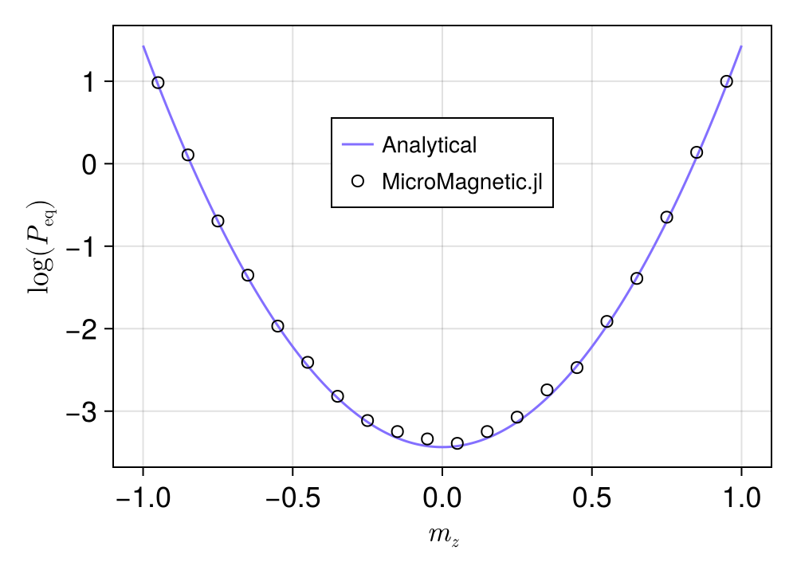

# Stochastic LLG

In this example, we will verify the thermal noise in SLLG, see [Fig.6 script](https://github.com/MagneticSimulation/MicroMagnetic.jl/blob/master/figure_scripts/fig6/sllg.jl).
We will then compare the distribution of magnetization with the analytical solution.

We import necessary packages.

```julia
using MicroMagnetic
using CairoMakie

@using_gpu()
```

We define a function to describe the simulation setup.

```julia
function run(; dt=1e-15)
    mesh = CubicMesh(; nx=30, ny=30, nz=30)

    V = 2.8e-26
    sim = Sim(mesh; driver="LLG", integrator="RungeKutta")
    sim.driver.alpha = 0.1
    sim.driver.gamma = 1.76e11
    sim.driver.integrator.step = dt

    #In principle, this value does not influence the result, however,
    #a large value will require a longer time to reach the equilibrium.
    set_mu_s(sim, 1.42e5 * V)

    init_m0_random(sim)

    add_anis(sim, 7.2e5 * V; axis=(0, 0, 1))
    add_thermal_noise(sim, 300.00)

    #dt = 1e-15, so the total time is 1e-15 * 1e5 = 1e-10 s
    relax(sim; max_steps=Int(1e5), stopping_dmdt=0, save_data_every=1000)

    save_vtk(sim, "sllg.vts")
    return sim
end
```

We define the analytical solution for the magnetization distribution.

```julia
using SpecialFunctions
function analytical()
    K = 7.2e5
    V = 2.8e-26
    T = 300
    chi = K * V / (k_B * T)
    Z = 2 * dawson(sqrt(chi)) / sqrt(chi)

    mzs = range(-1, 1, 201)
    ps = 1.0 / Z * exp.(-chi * (1 .- mzs .^ 2))
    return mzs, ps
end
```

To run the simulation and plot the distribution of magnetization, we define the following function.
Note: the package `StatsBase`, `SpecialFunctions` and `LinearAlgebra` are required for this function.

```julia
using StatsBase
using LinearAlgebra
function run_and_plot()
    if !isfile("sllg.vts")
        run()
    end

    m = MicroMagnetic.read_vtk("sllg.vts")
    m = reshape(m, 3, div(length(m), 3))

    hist = fit(Histogram, m[3, :], -1:0.1:1; closed=:right)
    mz = midpoints(hist.edges[1])
    h = normalize(hist; mode=:pdf)

    fig = Figure(; size=(400, 260), backgroundcolor=:transparent)
    ax = Axis(fig[1, 1]; xlabel=L"$m_z$", ylabel=L"log($P_\mathrm{eq}$)", backgroundcolor=:transparent)

    mzs, ps = analytical()
    l1 = lines!(ax, mzs, log.(ps); linestyle=:solid, color=:slateblue1, label="Analytical")
    s1 = scatter!(ax, mz, log.(h.weights); markersize=10, strokewidth=1, alpha=0,
                  color=:white, label="MicroMagnetic.jl")

    axislegend(ax; position=(0.5, 0.75), labelsize=14)

    save("P_mz.png", fig)
    return fig
end
```

Run the simulation and plot the distribution of magnetization

```julia
run_and_plot()
```

The plot should look like this:

