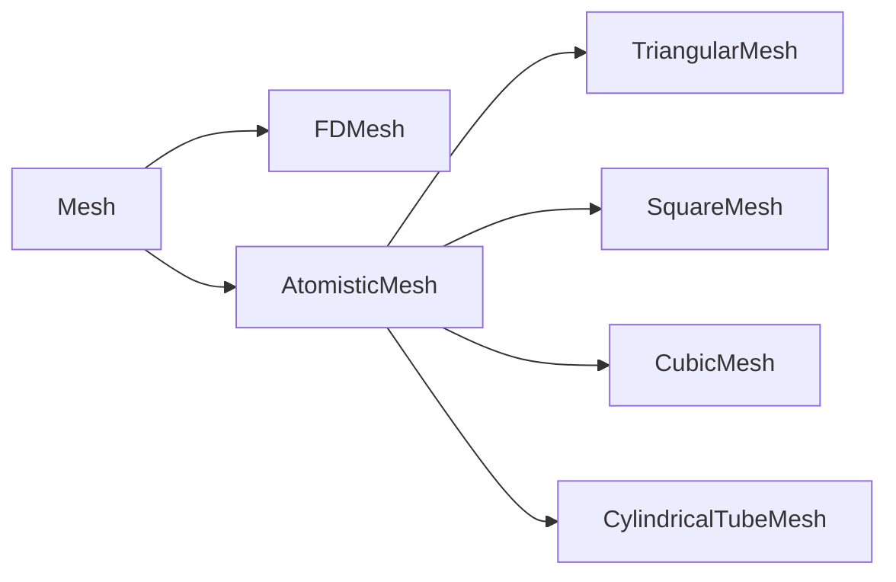
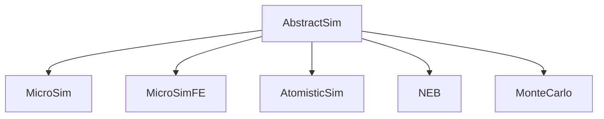
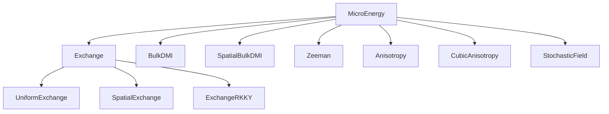
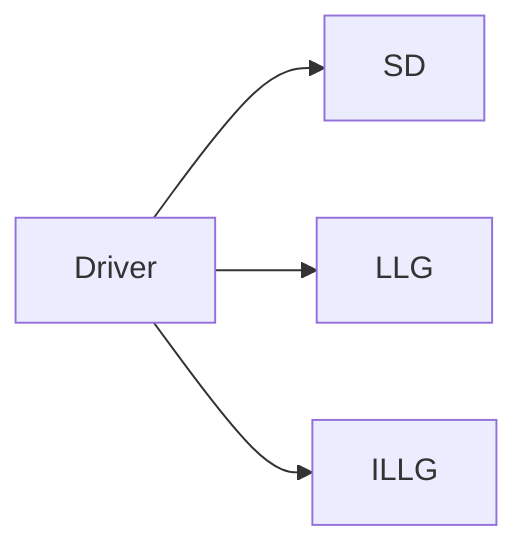

# Basics

## Meshes

MicroMagnetic uses finite difference methods to discretize the micromagnetic energies. In MicroMagnetic, the discretized grid information 
is stored in [`FDMesh`](@ref). Therefore, before starting the simulation, we need to create a mesh.

```julia
mesh = FDMesh(;dx=1e-9, dy=1e-9, dz=1e-9, nx=1, ny=1, nz=1)
```

In fact, [`FDMesh`](@ref) is used in our micromagnetic simulations, while for atomic models, we can use [`CubicMesh`](@ref), [`TriangularMesh`](@ref), as well as [`CylindricalTubeMesh`](@ref), etc.




## Sim

MicroMagnetic provides different Sim objects tailored to various computational systems and problem types. The framework defines five main simulation types with the following inheritance structure:



For [MicroSim](@ref MicroMagnetic.MicroSim), [AtomisticSim](@ref MicroMagnetic.AtomisticSim), you have two creation options: the [`create_sim`](@ref) function or the direct `Sim` constructor. The `create_sim` function provides a streamlined approach for parameter specification.

### Example: Simulation Creation

**Method 1: Using `Sim` constructor**
```julia
sim = Sim(mesh; driver="SD", name="std4")

set_Ms(sim, 8e5)           # Set saturation magnetization
add_exch(sim, 1.3e-11)     # Add exchange interaction
add_demag(sim)             # Add demagnetization
init_m0(sim, (1, 0.25, 0.1))  # Initialize magnetization
```

**Method 2: Using `create_sim` function**
```julia
sim = create_sim(mesh, driver="SD", Ms=8e5, A=1.3e-11, demag=true, m0=(1, 0.25, 0.1))
```

Both methods produce equivalent simulation configurations. The `create_sim` approach offers a more concise syntax for common parameter combinations.

All simulation data is accessible through the `sim` object, with the magnetization distribution available via `sim.spin` at any time.

!!! note
    By default, the magnetization is stored in a 1D array with the form ``[m_{1,x}, m_{1, y}, m_{1, z}, ..., m_{n,x}, m_{n, y}, m_{n, z}]``, which can be reshaped into a 4D array
    ```julia
    m = reshape(sim.spin, 3, nx, ny, nz)
    mx = m[1, :, :, :]
    my = m[2, :, :, :]
    mz = m[3, :, :, :]
    ```

## Functions

In MicroMagnetic, all parameters can be set using functions. For example, we can use the [`set_Ms`](@ref) function to set the saturation magnetization of the system. Of course, Ms should be a scalar for the same material, and we can set it like this:
```julia
set_Ms(sim, 8.6e5)
```
Additionally, we can set it with a function, like this:
```julia
function circular_Ms(i,j,k,dx,dy,dz)
    if (i-50.5)^2 + (j-50.5)^2 <= 50^2
        return 8.6e5
    end
    return 0.0
end
set_Ms(sim, circular_Ms)
```
Alternatively, the circular_Ms function can take three parameters 

```julia
function circular_Ms(x, y, z)
    if x^2 + y^2 <= (50nm)^2
        return 8.6e5
    end
    return 0.0
end
set_Ms(sim, circular_Ms)
```

Note that the Mesh we create is actually a regular cuboid, but in reality, the shape of the sample is not necessarily a cuboid. At this time, we define a round disk, 
where its Ms is 0 outside the disk. In this way, we can define the shape of the simulation system. Please note that in MicroMagnetic, almost all setting functions can 
accept a function as input. This cell-based approach maximizes flexibility, allowing for defining shapes, defining multiple materials, etc.

## Shapes

### Basic Shapes

In addition to using functions to define shapes, for some regular shapes and their combinations, we can use basic shapes and boolean operations defined in MicroMagnetic to achieve this. MicroMagnetic supports Plane, Cylinder, Sphere, Box, and Torus, etc., as basic shapes.

!!! note 
    | **operator** | **Boolean operation** |
    | :----------: | :-------------------: |
    | +            | Union                 |
    | -            | Difference            |
    | *            | Intersection          |

Example:
```julia
using MicroMagnetic

mesh = FDMesh(dx=2e-9, dy=2e-9, dz=2e-9, nx=100, ny=100, nz=50)

p1 = Plane(point=(40e-9,0,0), normal=(1, 0, 0))
save_vtk(mesh, p1, "shape1")

c1 = Cylinder(radius=30e-9, normal=(0.3,0,1))
save_vtk(mesh, c1, "shape2")

s1 = Sphere(radius = 30e-9, center=(50e-9, 0, 0))
save_vtk(mesh, s1, "shape3")

b1 = Box(sides = (110e-9, 50e-9, Inf), theta=pi/4)
save_vtk(mesh, b1, "shape4")

t1 = Torus(R = 60e-9, r=20e-9)
save_vtk(mesh, t1, "shape5")

t2 = t1 - b1 
save_vtk(mesh, t2, "shape6")

t3 = t1 * b1 
save_vtk(mesh, t3, "shape7")

t4 = t1 - p1 + (s1 * p1)
save_vtk(mesh, t4, "shape8")
```
The saved vts files can be visualized using programs such as Paraview, as shown below:


The created shapes can be used to set parameters, such as
```julia
set_Ms(sim::AbstractSim, geo::Shape, Ms::Number)
```
### Custom Shapes

We can also define custom shapes using the `create_shape` function. Custom shapes can also be combined with basic shapes using boolean operations.

## Energy Terms

After creating Sim, we can call functions to add energy terms that need to be considered in the simulation. For example, add_zeeman, add_exch, add_dmi, add_demag 
correspondingly add Zeeman energy, exchange interaction energy, DMI, and demagnetization energy.

Note
```julia
sim = create_sim(mesh, Ms=8e5, A=1.3e-11)
```
and
```julia
sim = create_sim(mesh)
set_Ms(sim, Ms=8e5)

ex = add_exch(sim, A=1.3e-11)
```
are equivalent. The advantage of the latter is that when we need exchange interaction data, we can directly access it through  `ex`.

MicroMagnetic implements energy terms 




## Driver




## Periodic Boundary conditions


## High-Level Interface

In **MicroMagnetic.jl**, a high-level interface called `sim_with` simplifies the setup and execution of micromagnetic simulations. This function allows you to package all relevant micromagnetic parameters into either a `NamedTuple` or a `Dict`, which can then be passed directly to `sim_with`. This approach streamlines the simulation setup process, making it more intuitive and flexible.

### Example: Hysteresis Loop Computation

Below is an example of how to use `sim_with` to compute a hysteresis loop. You can use either a `NamedTuple` or a `Dict` to define the parameters.

```julia
using MicroMagnetic

# Using NamedTuple
args = (
    task = "Relax",
    mesh = FDMesh(nx=50, ny=10, nz=1, dx=2.5e-9, dy=2.5e-9, dz=2.5e-9),
    Ms = 8e5, 
    A = 1.3e-11,
    demag = true,
    m0 = (-1, 0, 0),
    stopping_dmdt = 0.01,
    H_s = [(i*50mT, i*50mT, 0) for i=-20:20]
)

sim_with(args)

# Using Dict
args = Dict(
    :task => "Relax",
    :mesh => FDMesh(nx=50, ny=10, nz=1, dx=2.5e-9, dy=2.5e-9, dz=2.5e-9),
    :Ms => 8e5, 
    :A => 1.3e-11,
    :demag => true,
    :m0 => (-1, 0, 0),
    :stopping_dmdt => 0.01,
    :H_s => [(i*50mT, i*50mT, 0) for i=-20:20]
)

sim_with(args)
```

In these examples, the external field `H` is varied using the `_s` suffix (or `_sweep` if preferred). This suffix can be applied to other parameters as well, including `Ms` (saturation magnetization), `Ku` (anisotropy constant), `A` (exchange constant), `D` (Dzyaloshinskii-Moriya interaction), `task` (e.g., "Relax" or "Dynamics"), and `driver` (e.g., "SD", "LLG", "LLG_STT"). This flexibility allows you to explore a wide range of micromagnetic scenarios, such as computing hysteresis loops or studying the effects of parameter variations.

### Example: Standard Problem 4

**MicroMagnetic.jl** supports common micromagnetic tasks such as **Relax** (finding a stable magnetization configuration) and **Dynamics** (simulating the time evolution of magnetization). The following example demonstrates how to perform both tasks in sequence.

```julia
args = (
    name = "std4",
    task_s = ["relax", "dynamics"],       # List of tasks
    mesh = FDMesh(nx=200, ny=50, nz=1, dx=2.5e-9, dy=2.5e-9, dz=3e-9),
    Ms = 8e5,                                 # Saturation magnetization
    A = 1.3e-11,                              # Exchange constant
    demag = true,                             # Enable demagnetization
    m0 = (1, 0.25, 0.1),                      # Initial magnetization
    alpha = 0.02,                             # Gilbert damping
    steps = 100,                              # Number of steps for dynamics
    dt = 0.01ns,                              # Step size
    stopping_dmdt = 0.01,                     # Stopping criterion for relaxation
    dynamic_m_interval = 1,                   # Save the magnetization each step
    H_s = [(0,0,0), (-24.6mT, 4.3mT, 0)]      # Static field sweep
)

sim_with(args)
```

In this example, the system first relaxes to a stable configuration, and then the dynamics of the magnetization are simulated after applying an external field. By passing parameters as either a `NamedTuple` or `Dict`, you can easily explore various micromagnetic scenarios with just a few lines of code, making the `sim_with` function a powerful tool for research and development in micromagnetics.

## Date Tables
The default output is a table containing the time and other information such as the average magnetization and the total micromagnetic energy. For example, a typical output file, std4_llg.txt, for the standard problem 4 looks like this:
```bash
#               step                time             E_total                 m_x                 m_y                 m_z              E_exch             E_demag           zeeman_Hx           zeeman_Hy           zeeman_Hz            E_zeeman 
#         <unitless>                 <s>                 <J>          <unitless>          <unitless>          <unitless>                 <J>                 <J>               <A/m>               <A/m>               <A/m>                 <J> 
                 0 +0.000000000000e+00 +4.115051854628e-18 +9.667212580262e-01 +1.257338112913e-01 -7.385005331088e-14 +9.037089803430e-20 +5.385778227602e-19 -1.957605800030e+04 +3.421831276476e+03                  0 +3.486103133834e-18 
                 1 +1.000000000000e-11 +4.114333464830e-18 +9.639179728939e-01 +1.351913897494e-01 -1.250730661783e-02 +9.462544896467e-20 +5.500491422752e-19 -1.957605800030e+04 +3.421831276476e+03                  0 +3.469658873590e-18 
                 2 +2.000000000000e-11 +4.111801776628e-18 +9.551564239768e-01 +1.622306459477e-01 -2.438419245932e-02 +1.068628783479e-19 +5.850504604422e-19 -1.957605800030e+04 +3.421831276476e+03                  0 +3.419888437838e-18 
                 3 +3.000000000000e-11 +4.105969312986e-18 +9.390555926959e-01 +2.048856549742e-01 -3.536001067826e-02 +1.257008993481e-19 +6.473045240481e-19 -1.957605800030e+04 +3.421831276476e+03                  0 +3.332963889590e-18 
                 4 +4.000000000000e-11 +4.095848754295e-18 +9.138819844184e-01 +2.603015538941e-01 -4.514306950195e-02 +1.488766054551e-19 +7.426421285983e-19 -1.957605800030e+04 +3.421831276476e+03                  0 +3.204330020242e-18 
                 5 +5.000000000000e-11 +4.081051470750e-18 +8.781758247793e-01 +3.249452438428e-01 -5.352916374499e-02 +1.740004133747e-19 +8.761719462188e-19 -1.957605800030e+04 +3.421831276476e+03                  0 +3.030879111157e-18 
                 6 +6.000000000000e-11 +4.061691865398e-18 +8.310929541279e-01 +3.950519627725e-01 -6.053913609321e-02 +1.994187817227e-19 +1.050348598931e-18 -1.957605800030e+04 +3.421831276476e+03                  0 +2.811924484744e-18 
                 7 +7.000000000000e-11 +4.038094515872e-18 +7.723089438169e-01 +4.670888629588e-01 -6.648801333991e-02 +2.251205085123e-19 +1.264426321284e-18 -1.957605800030e+04 +3.421831276476e+03                  0 +2.548547686076e-18 
                 8 +8.000000000000e-11 +4.010448851303e-18 +7.016388084672e-01 +5.379604799389e-01 -7.195373892384e-02 +2.514962280097e-19 +1.516889929610e-18 -1.957605800030e+04 +3.421831276476e+03                  0 +2.242062693683e-18 
                 9 +9.000000000000e-11 +3.978492775965e-18 +6.185749984028e-01 +6.048546363741e-01 -7.770725658904e-02 +2.792453923841e-19 +1.806836879936e-18 -1.957605800030e+04 +3.421831276476e+03                  0 +1.892410503645e-18 
                10 +1.000000000000e-10 +3.941195510354e-18 +5.219398286586e-01 +6.647281597038e-01 -8.465287207565e-02 +3.110925716068e-19 +2.132894634005e-18 -1.957605800030e+04 +3.421831276476e+03                  0 +1.497208304741e-18 
    
```

We provide the `read_table` function to read the table from `std4_llg.txt`:
```julia
data, units = read_table("std4_llg.txt")
```
Both data and units are Dict objects, allowing easy access to the data. For example, you can access the time and magnetization components with data["time"] and data["m_x"]. This makes it easy to plot the results, as shown in the following example:
```julia
using MicroMagnetic
using CairoMakie
function plot_m_ts()
    #Load data
    data, unit = read_table("std4_llg.txt")

    #Create a figure for the plot
    fig = Figure(size=(800, 480))
    ax = Axis(fig[1, 1], xlabel="Time (ns)", ylabel="m")

    #Plot MicroMagnetic results
    scatter!(ax, data["time"] * 1e9, data["m_x"], markersize=6, label="m_x")
    scatter!(ax, data["time"] * 1e9, data["m_y"], markersize=6, label="m_y")
    scatter!(ax, data["time"] * 1e9, data["m_z"], markersize=6, label="m_z")

    #Add legend to the plot
    axislegend()

    save("mxyz.pdf", fig)

    return fig
end
```

## Custom Table

If you want to save additional quantities during the simulation, you can create a `SaverItem` and append it to the default saver. For example, to calculate and save the guiding center of the magnetization, you can use the following:

```julia
item = SaverItem(("Rx", "Ry"), ("<m>", "<m>"), compute_guiding_center)
push!(sim.saver.items, item)
```

Alternatively, if you're using `sim_with` or `run_sim`, you can pass the `SaverItem` directly as a parameter:

```julia
run_sim(sim, saver_item=item)
```

This allows you to extend the default output with custom quantities of interest, such as the guiding center, alongside the standard simulation data.

## Timings 

In MicroMagnetic.jl, we make use of TimerOutputs.jl to measure execution time in various tasks. After running the simulation, 
the measured times are stored in `MicroMagnetic.timer`, so we can simply use 
```julia
println(MicroMagnetic.timer)
```
to display the timing information. A typical output is shown below:

```bash
 ────────────────────────────────────────────────────────────────────────────────────
                                            Time                    Allocations
                                   ───────────────────────   ────────────────────────
         Tot / % measured:              16.1s /  82.8%            705MiB /  92.4%

 Section                   ncalls     time    %tot     avg     alloc    %tot      avg
 ────────────────────────────────────────────────────────────────────────────────────
 run_until                    101    12.8s   95.8%   127ms    632MiB   97.1%  6.26MiB
   demag                    25.1k    8.83s   66.2%   351μs    341MiB   52.4%  13.9KiB
   exch                     25.1k    780ms    5.8%  31.0μs   72.5MiB   11.1%  2.95KiB
   zeeman                   25.1k    523ms    3.9%  20.8μs   46.0MiB    7.1%  1.87KiB
   compute_system_energy      101   42.3ms    0.3%   419μs   1.93MiB    0.3%  19.5KiB
 run_step                     366    322ms    2.4%   880μs   12.7MiB    2.0%  35.6KiB
   demag                      366    191ms    1.4%   521μs   5.60MiB    0.9%  15.7KiB
   exch                       366   20.2ms    0.2%  55.3μs   1.12MiB    0.2%  3.14KiB
 compute_system_energy        367    232ms    1.7%   632μs   6.41MiB    1.0%  17.9KiB
 ────────────────────────────────────────────────────────────────────────────────────
```

Note: We have removed all explicit synchronization so the measured time for each component are not accurate for GPU backends.
