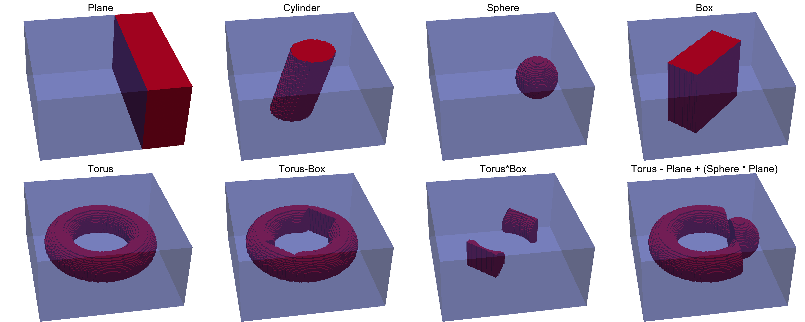

# Basics

## Meshes

MicroMagnetic uses finite difference methods to discretize the micromagnetic energies. In MicroMagnetic, the discretized grid information 
is stored in [`FDMesh`](@ref). Therefore, before starting the simulation, we need to create a mesh.

```julia
mesh = FDMesh(;dx=1e-9, dy=1e-9, dz=1e-9, nx=1, ny=1, nz=1)
```

In fact, [`FDMesh`](@ref) is used in our micromagnetic simulations, while for atomic models, we can use [`CubicMesh`](@ref), [`TriangularMesh`](@ref), as well as [`CylindricalTubeMesh`](@ref), etc.

```@raw html
<div class="mermaid">
graph LR;
    Mesh --> FDMesh
    Mesh --> AtomisticMesh
    AtomisticMesh --> TriangularMesh
    AtomisticMesh --> SquareMesh
    AtomisticMesh --> CubicMesh
    AtomisticMesh --> CylindricalTubeMesh
</div>
```

## Sim
In MicroMagnetic, we can create different Sim objects based on the computational system or problem type. MicroMagnetic defines four types of Sims:

```@raw html
<div class="mermaid">
graph LR
   AbstractSim --> MicroSim
   AbstractSim --> AtomisticSim
   AbstractSim --> NEB
   AbstractSim --> MonteCarlo
</div>
```

For [MicroSim](@ref MicroMagnetic.MicroSim) and [AtomisticSim](@ref MicroMagnetic.AtomisticSim), we recommend using the [`create_sim`](@ref) function to create them, as the [`create_sim`](@ref) function 
can specify some parameters while creating Sim. Of course, these parameters can also be specified later. 

```julia
sim = create_sim(mesh)
```
Note: all simulation data can be obtained through sim, especially, we can obtain the magnetization distribution state of the system through `sim.spin` at any time.

!!! note
    By default, the magnetization is stored in a 1D array with the form ``[m_{1,x}, m_{1, y}, m_{1, z}, ..., m_{n,x}, m_{n, y}, m_{n, z}]``, which can be reshaped into a 4D array
    ```julia
    m = reshape(sim.spin, 3, nx, ny, nz)
    mx = m[1, :, :, :]
    my = m[2, :, :, :]
    mz = m[3, :, :, :]
    ```


## Functions

In MicroMagnetic, all parameters can be set using functions. For example, we can use the [`set_Ms`](@ref) function to set the saturation magnetization of the system. Of course, Ms should be a scalar for the same material, and we can set it like this:
```julia
set_Ms(sim, 8.6e5)
```
Additionally, we can set it with a function, like this:
```
function circular_Ms(i,j,k,dx,dy,dz)
    if (i-50.5)^2 + (j-50.5)^2 <= 50^2
        return 8.6e5
    end
    return 0.0
end
set_Ms(sim, circular_Ms)
```
Note that the Mesh we create is actually a regular cuboid, but in reality, the shape of the sample is not necessarily a cuboid. At this time, we define a round disk, 
where its Ms is 0 outside the disk. In this way, we can define the shape of the simulation system. Please note that in MicroMagnetic, almost all setting functions can 
accept a function as input. This cell-based approach maximizes flexibility, allowing for defining shapes, defining multiple materials, etc.

## Shapes

### Basic Shapes

In addition to using functions to define shapes, for some regular shapes and their combinations, we can use basic shapes and boolean operations defined in MicroMagnetic to achieve this. MicroMagnetic supports Plane, Cylinder, Sphere, Box, and Torus, etc., as basic shapes.

!!! note 
    | **operator** | **Boolean operation** |
    | :----------: | :-------------------: |
    | +            | Union                 |
    | -            | Difference            |
    | *            | Intersection          |

Example:
```julia
using MicroMagnetic

mesh = FDMesh(dx=2e-9, dy=2e-9, dz=2e-9, nx=100, ny=100, nz=50)

p1 = Plane(point=(40e-9,0,0), normal=(1, 0, 0))
save_vtk(mesh, p1, "shape1")

c1 = Cylinder(radius=30e-9, normal=(0.3,0,1))
save_vtk(mesh, c1, "shape2")

s1 = Sphere(radius = 30e-9, center=(50e-9, 0, 0))
save_vtk(mesh, s1, "shape3")

b1 = Box(sides = (110e-9, 50e-9, Inf), theta=pi/4)
save_vtk(mesh, b1, "shape4")

t1 = Torus(R = 60e-9, r=20e-9)
save_vtk(mesh, t1, "shape5")

t2 = t1 - b1 
save_vtk(mesh, t2, "shape6")

t3 = t1 * b1 
save_vtk(mesh, t3, "shape7")

t4 = t1 - p1 + (s1 * p1)
save_vtk(mesh, t4, "shape8")
```
The saved vts files can be visualized using programs such as Paraview, as shown below:



The created shapes can be used to set parameters, such as
```julia
set_Ms(sim::AbstractSim, geo::Shape, Ms::Number)
```
### Custom Shapes

We can also define custom shapes using the `create_shape` function. Custom shapes can also be combined with basic shapes using boolean operations.

## Energy Terms

After creating Sim, we can call functions to add energy terms that need to be considered in the simulation. For example, add_zeeman, add_exch, add_dmi, add_demag 
correspondingly add Zeeman energy, exchange interaction energy, DMI, and demagnetization energy.

Note
```julia
sim = create_sim(mesh, Ms=8e5, A=1.3e-11)
```
and
```julia
sim = create_sim(mesh)
set_Ms(sim, Ms=8e5)

ex = add_exch(sim, A=1.3e-11)
```
are equivalent. The advantage of the latter is that when we need exchange interaction data, we can directly access it through  `ex`.

MicroMagnetic implements energy terms 

```@raw html
<div class="mermaid">
graph TD;
    MicroEnergy --> Exchange
    Exchange --> UniformExchange
    Exchange --> SpatialExchange
    Exchange --> ExchangeRKKY
    MicroEnergy --> BulkDMI
    MicroEnergy --> SpatialBulkDMI
    MicroEnergy --> Zeeman
    MicroEnergy --> Anisotropy
    MicroEnergy --> CubicAnisotropy
    MicroEnergy --> StochasticField    
</div>
```


## Driver

```@raw html
<div class="mermaid">
graph LR;
    Driver --> LLG
    Driver --> LLG_STT
    Driver --> EnergyMinimization
</div>
```


## Periodic Boundary conditions


## High-Level Interface

In MicroMagnetic.jl, we offer a high-level interface called [sim_with](@ref).

This function allows you to bundle all micromagnetic parameters into a `Dict` or `NamedTuple` and pass them directly to [sim_with](@ref). 
For example, we can compute hysteresis loops using the following script:

```julia
using MicroMagnetic

args = (
    task = "Relax",
    mesh = FDMesh(nx=50, ny=10, nz=1, dx=2.5e-9, dy=2.5e-9, dz=2.5e-9),
    Ms = 8e5, 
    A = 1.3e-11,
    demag = true,
    m0 = (-1, 0, 0),
    stopping_dmdt = 0.01,
    H_range = [(i*50mT, i*50mT, 0) for i=-20:20]
)

sim_with(args)
```
In this exmaple, the external field `H` is varied using the `_range` suffix. Using the `_range` syntax, we can not only vary the external field `H`, but also explore the effects of changing other parameters such as `Ms` (saturation magnetization), `Ku` (anisotropy constant), `A` (exchange constant), and `D` (Dzyaloshinskii-Moriya interaction),
enabling us to explore various micromagnetic scenarios, such as computing hysteresis loops or studying the effects of parameter changes.

In MicroMagnetic.jl, two common tasks are supported: `Relax` and `Dynamics`.

#### Relax: 
Given an initial magnetization distribution, this task finds the stable magnetization configuration.

#### Dynamics:
This task computes the time evolution of a given magnetization distribution under specified excitations.

In the above example, the task is defined as `Relax`. Actually, the `task` and `driver` could be an array. For instance, standard problem 4 can be defined as follows:
```julia
args = (
    name = "std4", 
    task = ["relax", "dynamics"],
    mesh = FDMesh(nx=200, ny=50, nz=1, dx=2.5e-9, dy=2.5e-9, dz=3e-9),
    Ms = 8e5,                 # Saturation magnetization
    A = 1.3e-11,              # Exchange constant
    demag = true,             # Enable demagnetization
    m0 = (1, 0.25, 0.1),      # Initial magnetization
    alpha = 0.02,             # Gilbert damping
    steps = 100,              # Number of steps for dynamics
    dt = 0.1ns,               # Step size
    stopping_dmdt = 0.01,     # Stopping criterion for relaxation
    H_range = [(0,0,0), (-24.6mT, 4.3mT, 0)] # Static field
)

sim_with(args)
```
The example above combines both `Relax` and `Dynamics` tasks: first, it finds a stable magnetization distribution from an initial state, and then computes the time evolution after 
changing external field `H` to `(-24.6mT, 4.3mT, 0)` using the `_range` suffix. 

This flexibility of `sim_with` allows us to explore a variety of micromagnetic scenarios with ease.


## Timings 

In MicroMagnetic.jl, we make use of TimerOutputs.jl to measure execution time in various tasks. After running the simulation, 
the measured times are stored in `MicroMagnetic.timer`, so we can simply use 
```julia
println(MicroMagnetic.timer)
```
to display the timing information. A typical output is shown below:

```bash
 ────────────────────────────────────────────────────────────────────────────────────
                                            Time                    Allocations
                                   ───────────────────────   ────────────────────────
         Tot / % measured:              16.1s /  82.8%            705MiB /  92.4%

 Section                   ncalls     time    %tot     avg     alloc    %tot      avg
 ────────────────────────────────────────────────────────────────────────────────────
 run_until                    101    12.8s   95.8%   127ms    632MiB   97.1%  6.26MiB
   demag                    25.1k    8.83s   66.2%   351μs    341MiB   52.4%  13.9KiB
   exch                     25.1k    780ms    5.8%  31.0μs   72.5MiB   11.1%  2.95KiB
   zeeman                   25.1k    523ms    3.9%  20.8μs   46.0MiB    7.1%  1.87KiB
   compute_system_energy      101   42.3ms    0.3%   419μs   1.93MiB    0.3%  19.5KiB
 run_step                     366    322ms    2.4%   880μs   12.7MiB    2.0%  35.6KiB
   demag                      366    191ms    1.4%   521μs   5.60MiB    0.9%  15.7KiB
   exch                       366   20.2ms    0.2%  55.3μs   1.12MiB    0.2%  3.14KiB
 compute_system_energy        367    232ms    1.7%   632μs   6.41MiB    1.0%  17.9KiB
 ────────────────────────────────────────────────────────────────────────────────────
```