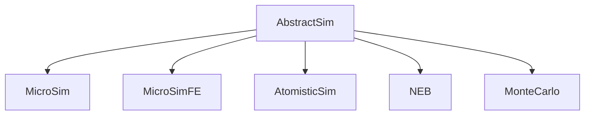

# Architecture Overview

```@meta
CurrentModule = MicroMagnetic
```

This page maps the source tree and the core design decisions a developer needs
before touching the code. For extension recipes (adding an energy term) see
[Contributing](@ref); for the parameter-representation system see
[Parameter System](params.md).

## Source tree

| path | contents |
| :--- | :--- |
| `src/MicroMagnetic.jl` | module definition, global state (precision/backend/groupsize), `set_precision` / `set_backend` / `set_verbose` |
| `src/head.jl` | `AbstractSim` hierarchy, energy-term and driver abstract types, type aliases (`NumberOrArrayOrFunction`, ...) |
| `src/fill.jl` | `Fill{T,N}` — O(1) storage for uniform parameters (see [Parameter System](params.md)) |
| `src/params.jl` | `make_param` / `make_vector_param` (the single materialisation point), `set_region`, `region_map` |
| `src/driver.jl` | `SD{T}` / `LLG{T}` / `InertialLLG{T}` drivers, `create_driver`, `set_driver` |
| `src/sim.jl` | `Sim` factory, `relax`, `run_sim`, `run_until`, `hysteresis`, saver plumbing |
| `src/micro/` | finite-difference micromagnetics: mesh, energy terms (`add_field.jl`), kernels, demag (incl. PBC solvers, stencil partition) |
| `src/atomistic/` | lattice spin dynamics: meshes (`CubicMesh`, `TriangularMesh`, `CylindricalTubeMesh`), energy terms, kernels |
| `src/llg/` | LLG right-hand sides: standard, Cayley form, inertial LLG |
| `src/integrator/` | adaptive RK family (DOPRI54, ...), Cayley integrators, Heun, GPSM |
| `src/mc/` | Monte Carlo (atomistic): `MonteCarlo` sim type, sweeps, observables |
| `src/fem/` | finite-element micromagnetics (FEMesh, `MicroSimFE`) |
| `src/eigen/` | eigenmode analysis: `build_matrix`, `LLGJacOperator`, symbolic mode |
| `src/transition/` | GNEB, saddle-point search, minimum-mode method |
| `src/neb/` | classical NEB |
| `src/tools/` | LTEM phase, topology (skyrmion number, guiding center) |
| `src/csg.jl` | constructive solid geometry shapes and boolean operators |
| `src/ovf2.jl` / `src/vtk.jl` / `src/fileio.jl` | OVF, VTK and table I/O |
| `src/server.jl` | WebSocket server behind `gui()` |
| `ext/CUDAExt.jl` etc. | backend package extensions (CUDA, AMDGPU, oneAPI, Metal) |

## Simulation type hierarchy



A `Sim` object owns four central buffers, all of length `3N` (N = number of
cells), interleaved as `[m₁ₓ, m₁ᵧ, m₁_z, m₂ₓ, ...]`:

- `sim.spin` — the magnetization state,
- `sim.field` — the accumulated effective field,
- `sim.prespin` — scratch copy used by `relax`,
- per-interaction `interaction.field` buffers.

Cell `(i, j, k)` maps to the flat index `id = (k-1)*nx*ny + (j-1)*nx + i`, so the
three components of the field at that cell are `field[3id-2 : 3id]`. To scan
neighbors, use the precomputed `mesh.ngbs` table (6 neighbors per cell, `id > 0`
means the neighbor exists; periodic axes wrap) rather than recomputing indices —
`index(i,j,k,...)` for open meshes and `indexpbc(...)` for periodic ones are the
canonical index helpers.

## Energy terms

Every term is a subtype of `MicroEnergy` (atomistic: `AtomisticEnergy`-style
kernels) stored in `sim.interactions::Array{MicroEnergy}`. The effective field
evaluation loops over interactions, computes each term's field into its private
buffer, then accumulates into `sim.field`. Each term also exposes its energy
density for the saver (`E_exch`, `E_demag`, ... columns).

Since the Fill refactor, a term's parameters are **arrays, never scalars**: a
uniform parameter is stored as a `Fill` (O(1)) and a spatial one as a dense
array, so `Exchange` / `DMI` / `LLG` have no `Spatial*` twin types anymore. See
[Parameter System](params.md) for the full contract.

## Drivers

`None`, `SD` (energy minimisation), `LLG` (Gilbert dynamics; also serves the
stochastic LLG via `add_thermal_noise`) and `InertialLLG`. Drivers are
parameterised by the element type `T` that is frozen in at `Sim` construction;
`set_driver` is the only supported way to switch (see
[Driver Internals](drivers.md)).

## Global state: precision, backend, group size

Three module-level `Ref`s exist (`Float`, `default_backend`, `groupsize`), but
their role is deliberately narrow — **constructor-time defaults**:

- `set_precision(T)` answers "what element type will *future* allocations use".
  A `Sim` freezes `T` into its type parameter; existing simulations are never
  touched (a warning fires if sims already exist). Legal values: `Float64`,
  `Float32`, `AbstractFloat` (symbolic mode, eigen workflow only).
- `set_backend(s)` answers "where will *future* allocations live". Kernels never
  read this global at run time — the invariant is **the backend is derived from
  the data**: `KernelAbstractions.get_backend(sim.spin)` (or the buffer the
  kernel actually touches). Host-side temporaries must not be used to derive a
  kernel backend; that compiles a CPU kernel against device arrays and fails
  with scalar-indexing errors.
- `set_groupsize(n)` is a pure performance knob for kernel launches.

Remaining legal read sites of the globals are allocation points only
(`create_zeros`, `make_param` host materialisation, `FDMesh` construction, the
setters themselves). When adding code, follow the same rule.

## Backend package extensions

The package itself only depends on KernelAbstractions. GPU support lives in
package extensions (`ext/CUDAExt.jl`, ...), each registering concrete array
types for the backend hooks (`to_sparse_csc` / `to_sparse_csr` /
`to_dense_matrix`, which are identity on CPU) and precompiling the kernels for
the GPU array types. Loading the extension happens through `@using_gpu()` or an
explicit `using CUDA`; `set_backend("cuda")` only makes sense afterwards.

## Data layout conventions

- spin/field arrays: flat `3N`, interleaved per cell (see above);
- scalar parameters: `Fill{T,1}` or `Vector{T}` of length N (never scalars);
- `mesh.region`: per-cell region id (`Int`), set with `set_region`, consumed by
  `region_map` and the stencil partition layer;
- energies saved per term via `SaverItem`s appended to `sim.saver.items`.
