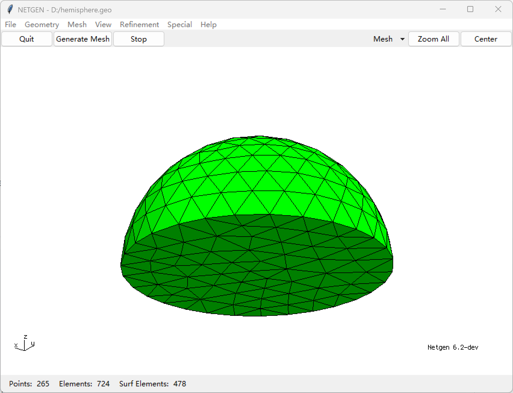
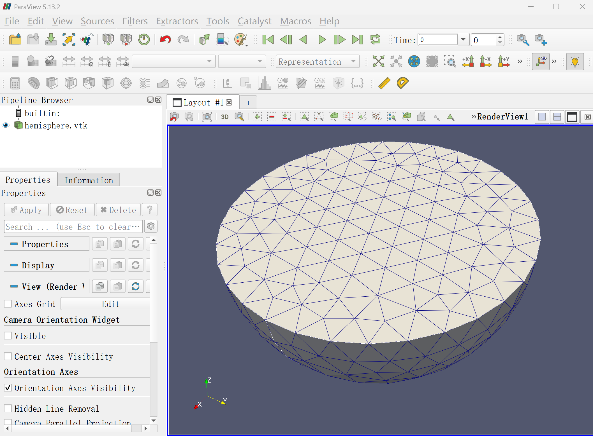

## Finite Element

The first and most crucial step in finite element micromagnetics is **mesh generation**. 
Several software tools are available for mesh generation. Here we introduce two primary options:

### 1. Netgen
- **Repository**: [https://github.com/NGSolve/netgen](https://github.com/NGSolve/netgen)
- **Documentation**: [https://github.com/NGSolve/netgen/blob/master/doc/ng4.pdf](https://github.com/NGSolve/netgen/blob/master/doc/ng4.pdf)
  
**Typical Usage** (creates hemisphere):
```ng
algebraic3d

solid hemisphere = sphere (1, 0, 0; 10) and plane (1, 0, 0; 0, 0, -1);

tlo hemisphere -maxh=2.0;
```
 
```@raw html

```

*MicroMagnetic.jl* natively supports Netgen's Neutral format.

### 2. Gmsh
- **Website**: [https://gmsh.info/](https://gmsh.info/)
- **Tutorial**: [https://gmsh.info/dev/doc/texinfo/gmsh.html#Gmsh-tutorial](https://gmsh.info/dev/doc/texinfo/gmsh.html#Gmsh-tutorial)

Gmsh supports OpenCASCADE geometry kernel, enabling direct creation of complex shapes. Below is a modified Julia example generating the same hemisphere and exporting to Gmsh format:

```julia
using Gmsh

gmsh.initialize()
gmsh.model.add("hemisphere")

# Create sphere and cutting box
sphere_tag = gmsh.model.occ.addSphere(1, 0, 0, 10)
box_tag = gmsh.model.occ.addBox(-100, -100, 0, 200, 200, 100)  # Large cutting box

# Perform boolean cut operation
hemisphere, _ = gmsh.model.occ.cut(
    [(3, sphere_tag)],  # Original sphere (dim=3)
    [(3, box_tag)]      # Cutting tool (dim=3)
)
gmsh.model.occ.synchronize()

# Generate mesh with size constraints
gmsh.option.setNumber("Mesh.MeshSizeMax", 2.0)
gmsh.model.mesh.generate(3)

# Export in Gmsh format
gmsh.write("hemisphere.msh")
gmsh.write("hemisphere.vtk")
gmsh.finalize()
```

The vtk file can be opened using Paraview, as follows:
  