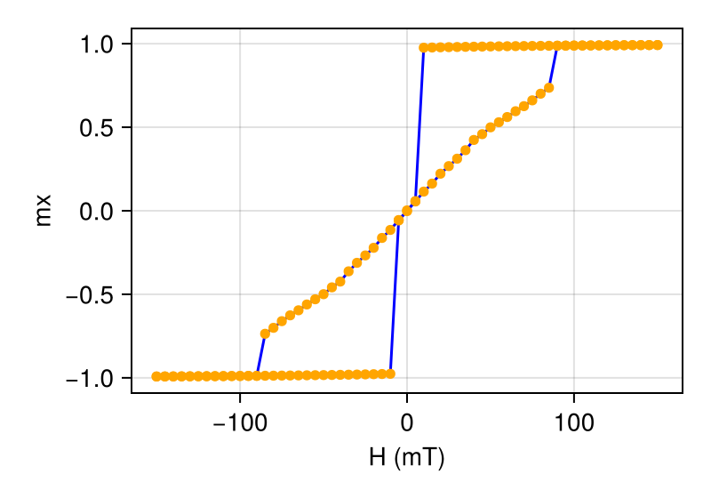

```@meta
ShareDefaultModule = true
```

# Thin Disk Hysteresis Loop

This example demonstrates how to simulate a hysteresis loop for a thin disk using **MicroMagnetic.jl**. We create a cylindrical thin disk sample, then apply a magnetic field sweep to study the hysteresis behavior. The disk exhibits a deflected vortex-like state during the magnetization process.

Import necessary modules and enable GPU acceleration (optional).    

````julia
using MicroMagnetic
using CairoMakie

#@using_gpu()
#using CUDSS # we need CUDSS to solve the linear system
````

## Step 1: Define the System Geometry

Create a cylindrical thin disk with radius 100 nm and thickness 20 nm using netgen:

````julia
algebraic3d

solid fincyl = cylinder ( 0, 0, 1; 0, 0, -1; 100.0 )
	and plane (0, 0, -10; 0, 0, -1)
	and plane (0, 0, 10; 0, 0, 1) -maxh = 5;

tlo fincyl;
````

## Step 2: Set Up the Simulation

Create a simulation with LLG driver and initialize the system with a uniform magnetization in the negative x-direction.

We recommend using BS23 or GPSM integrator. The code below uses BS23:

````julia
function setup_simulation()
    mesh = FDMesh("./meshes/nanodot.mesh", unit_length=1e-9)
    sim = Sim(mesh, driver="LLG", integrator="BS23", name="disk")
   
    sim.driver.alpha = 0.5
    sim.driver.integrator.tol = 1e-6

    set_Ms(sim, 8e5)

    init_m0(sim, (-1, 0, 0))
    
    # Add interactions
    add_exch(sim, 1.3e-11)
    add_demag(sim)
    
    # Add initial zero field
    add_zeeman(sim, (0, 0, 0))
    
    return sim
end

# Create simulation instance
sim = setup_simulation();
````

Typical setup for GPSM integrator:

````julia
function setup_simulation()
    mesh = FDMesh("./meshes/nanodot.mesh", unit_length=1e-9)
    sim = Sim(mesh, driver="LLG", integrator="GPSM", name="disk")
      
    sim.driver.alpha = 0.5
    sim.driver.integrator.step = 1e-12 # 1ps every step

    set_Ms(sim, 8e5)

    init_m0(sim, (-1, 0, 0))
    
    # Add interactions
    add_exch(sim, 1.3e-11)
    add_demag(sim)
    
    # Add initial zero field
    add_zeeman(sim, (0, 0, 0))
    
    return sim
end

# Create simulation instance
sim = setup_simulation();
````

## Step 3: Compute Hysteresis Loop

Apply a magnetic field sweep from -150 mT to 150 mT along the x-direction.

````julia
# Define field sweep (from -150 mT to 100 mT in 5 mT steps)
Hs = [i*mT for i=-150:5:150]

# Compute hysteresis loop
hysteresis(sim, Hs, direction=(1, 0, 0), full_loop=false, stopping_dmdt=0.05, output="vtu")
nothing #hide
````

## Step 4: Visualize the Results

Plot the hysteresis loop using the data generated from the simulation.

````@example
using CairoMakie
fig = plot_ts("disk_llg.txt", x_key="Hx", ["m_x"], x_unit=1/mT, xlabel="H (mT)", ylabel="m", mirror_loop=true);
````

```@raw html

```

You can download the complete simulation script used in this example:
```@raw html
<a href="https://raw.githubusercontent.com/MagneticSimulation/MicroMagnetic.jl/master/docs/src/fem/hysteresis.jl" download>Download hysteresis.jl</a>
```