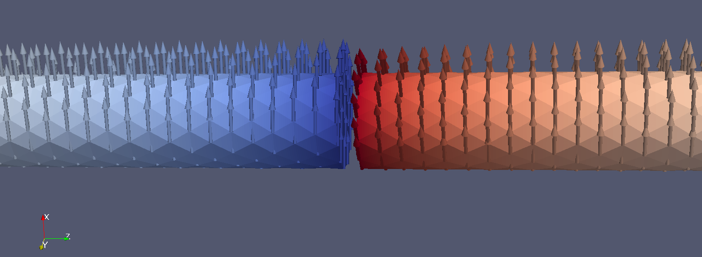

```@meta
ShareDefaultModule = true
```

# RKKY-type Interaction

In Micromagnetic.jl, we implement the RKKY-type exchange interaction through the [`add_exch_int`](@ref) function:

```julia
add_exch_int(sim::MicroSimFE, J::Number; k1=1, k2=2, name="rkky")
```
This function adds an RKKY-type exchange interaction between layers. The energy of the RKKY-type exchange is defined as:
```math
E_\mathrm{rkky} =  - \int_\Gamma J_\mathrm{rkky} \mathbf{m}_{i} \cdot \mathbf{m}_{j} dA
```
where $\Gamma$ is the interface between two layers with magnetizations $\mathbf{m}_{i}$ and $\mathbf{m}_{j}$, and $J_\mathrm{rkky}$ is the coupling constant (with units of J/m²) that depends on the spacer layer thickness.

# Example

Following the approach in PhysRevB.107.104424, we consider two layers with antiferromagnetic coupling, exchange interaction, uniaxial anisotropy, and an external magnetic field. The steady-state magnetization distribution should match the patterns shown in Figures 1 and 4 of that paper.

We model a nanorod aligned along the z-axis with radius $R = 5$ nm and total length $L = 200$ nm. A 2 nm thick non-magnetic gap separates the two magnetic layers. An external magnetic field $H_x = 10^4$ A/m is applied along the x-axis.

Due to the antiferromagnetic coupling between layers, their magnetizations form an angle $2\phi$ that satisfies:
```math
h_x = \frac{1}{4} \cdot \frac{\cos(2\phi) - 1 - j \sin^2(2\phi)}{\cos(\phi) - 1}
```
where $h_x$ and $j$ are defined in equations (3.9) and (3.10) of PhysRevB.107.104424. The figure below shows the magnetization distribution computed using our finite element method.

```@raw html

```

## Mesh Creation

We first create a rod with a central gap using Netgen. Boundary conditions 1 and 3 are assigned to the top and bottom surfaces of the gap, respectively, where the antiferromagnetic coupling will be applied:

```
algebraic3d

solid p1 = plane (0, 0, 1; 0, 0, -1) -bc=1;
solid p2 = plane (0, 0, 100; 0, 0, 1) -bc=2;

solid p3 = plane (0, 0, -1; 0, 0, 1) -bc=3;
solid p4 = plane (0, 0, -100; 0, 0, -1) -bc=4;

solid c1 = cylinder ( 0, 0, -100; 0, 0, 100; 5.0 )
	and p1 and p2 -maxh = 5;

solid c2 = cylinder ( 0, 0, -100; 0, 0, 100; 5.0 )
	and p3 and p4 -maxh = 5;

solid main = c1 or c2;
tlo main;

#identify periodic p1 p3;
```

Netgen also supports periodic boundary conditions, which can be specified using `#identify periodic p1 p3;` to ensure perfectly matching meshes on both surfaces. This step is optional, as Micromagnetic.jl can handle non-matching boundaries as well. When exporting the mesh from Netgen, select the neutral format.

## Simulation Setup

First, import MicroMagnetic and create the mesh:

````@example
using MicroMagnetic
using CairoMakie

mesh = FEMesh("./meshes/nanorod.mesh", unit_length=1e-9);
nothing #hide
````

Next, define a function to relax the system to its equilibrium state:

````@example
function relax_system()
    sim = Sim(mesh; driver="SD", name="rkky")

    # Material parameters
    K, A, Ms = 1e4, 1.3e-11, 8e5
    j = 2
    h = 4
    
    # Derived parameters
    J = sqrt(2*j*A*K)
    H = h*2*K/(mu_0*Ms)
    
    # Set up the system
    set_Ms(sim, Ms)  
    add_exch(sim, A)
    add_anis(sim, K, axis=(0, 1, 0))
    add_exch_int(sim, -J; k1=1, k2=3, name="rkky")
    add_zeeman(sim, (H, 0, 0))

    # Initialize magnetization and relax
    m0_fun(x, y, z) = z <= 0 ? (0, -1, 0) : (0, 1, 0)
    init_m0(sim, m0_fun)
    relax(sim; stopping_dmdt=0.001)

    # Save results and return magnetization
    save_vtk(sim, "rkky.vtu")
    return Array(sim.spin)
end
nothing #hide
````

## Results Analysis

Now run the relaxation function and analyze the results. Due to the irregular mesh, we sample the magnetization distribution at 90 points along the z-axis and compute the angle $\phi$:

````@example
spin = relax_system()
zs = [i + eps() for i in 1:90]
points = [[0, 0, z] for z in zs]
m = interpolate_field(mesh, spin, points)
m = reshape(m, (3, length(zs)))
phi = asin.(m[2, :]) / pi * 180
println("max phi = ", phi[1])   

function plot_magnetization_angle(zs, phi)
    fig = Figure(; size=(400, 280), backgroundcolor=:transparent)
    ax = Axis(fig[1, 1]; xlabel="z (nm)", ylabel=L"\phi", backgroundcolor=:transparent)

    scatterlines!(ax, zs, phi; markersize=6, color=:blue, markercolor=:orange)
    return fig
end

fig = plot_magnetization_angle(zs, phi)
````

We can observe that $\phi$ decays with position and reaches a maximum value of 25.246 degrees.
For the case $h_x=4$ and $j=2$, we can numerically solve the equation to obtain $\phi = 26.25^irc$, which agrees well with the numerical results.

## Download

You can download the complete simulation script used in this example:

```@raw html
<a href="https://raw.githubusercontent.com/MagneticSimulation/MicroMagnetic.jl/master/docs/src/fem/rkky.jl" download>Download rkky.jl</a>
```
