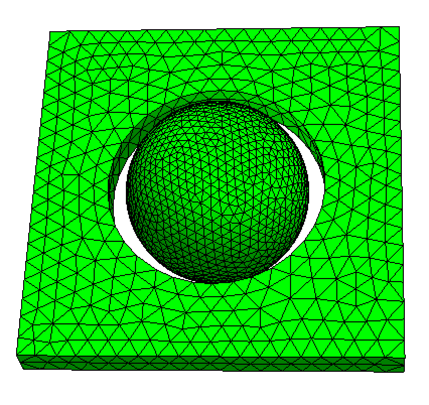
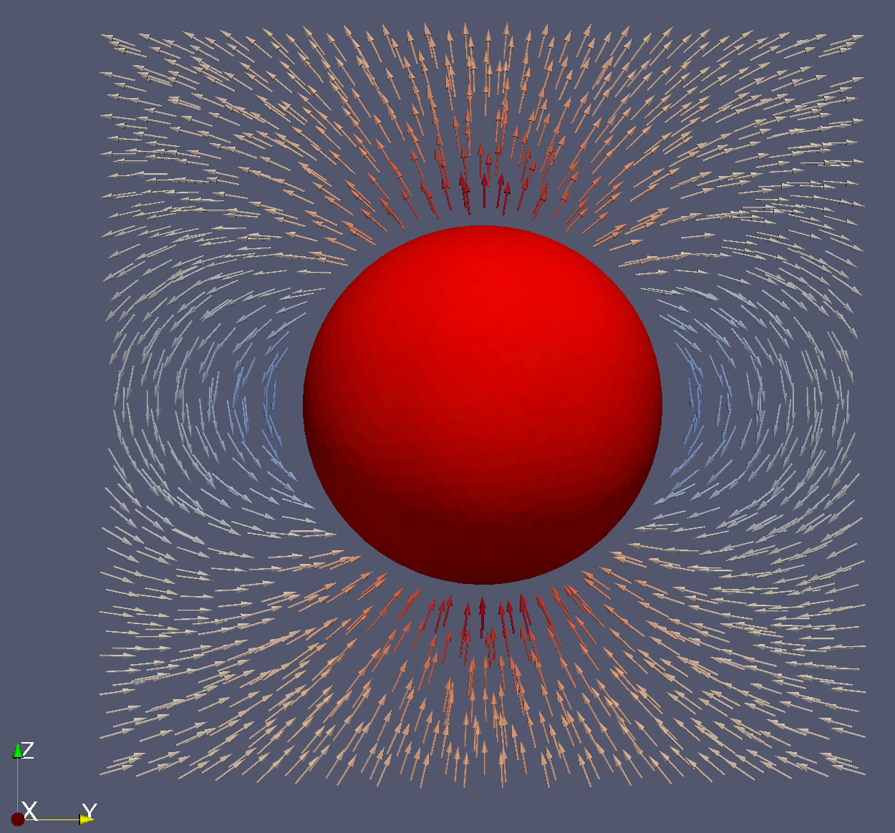

```@meta
ShareDefaultModule = true
```

# Demagnetizing Field Inside and Around a Uniformly Magnetized Sphere

In this example, we use the finite element method (FEM) to compute the demagnetizing field inside and around a uniformly magnetized sphere. 
It is well known that for a uniformly magnetized sphere with magnetization vector $\mathbf{M} = M_s \mathbf{e}_z$, the magnetic field inside 
the sphere is given by:

```math
\mathbf{H}_{\text{int}} = -\frac{1}{3} \mathbf{M} = -\frac{1}{3} M_s \mathbf{e}_z
```

Outside the sphere, the field is equivalent to that produced by a magnetic dipole with moment $\mathbf{m} = \mathbf{M} V$, 
where $V=\frac{4}{3} R_0^3$ is the volume of the sphere.

The corresponding magnetic scalar potential $\phi_m$ satisfies:

```math
\phi_m(\mathbf{r}) = 
\begin{cases}
\frac{1}{3} \mathbf{M} \cdot \mathbf{R} & \text{inside the sphere} \\
\frac{1}{3} \frac{R_0^3}{R^3} \mathbf{M} \cdot \mathbf{R} & \text{outside the sphere}
\end{cases}
```

We begin by generating the simulation mesh using Netgen. The following `sphere_air.geo` file defines the geometry:

```
algebraic3d

solid sp = sphere(0, 0, 0; 10);

solid air = orthobrick(-2,-20,-20; 2, 20, 20) and not sphere(0, 0, 0; 12);

tlo sp -maxh=1.0;

tlo air -maxh=2.0;
```

This script creates:
- A solid sphere (`sp`) centered at the origin with radius 10
- An air box (`air`) that surrounds the sphere with a buffer region
- Different mesh sizes are assigned to the sphere (finer mesh) and air region (coarser mesh)

The resulting mesh looks like:

```@raw html

```

Note that the sphere and air are defined as separate solids. This allows the sphere to be labeled as region 1 and the air as region 2, 
enabling different material parameter assignments in subsequent simulations.

## Simulation Setup

Import the necessary modules:

```@example
using MicroMagnetic
using Printf
```

Read the mesh file:

```julia
mesh = FEMesh("sphere_air.mesh")
```

A coarser [sphere_air.mesh](https://github.com/MagneticSimulation/MicroMagnetic.jl/tree/master/test/fem/meshes/sphere_air.mesh) is available.
Create a simulation object and set the saturation magnetization for region 1 (the sphere):

```julia
sim = Sim(mesh; driver="SD")
set_Ms(sim, 8e5, region_id=1)  # 800,000 A/m saturation magnetization
```

Set the initial magnetization direction and add the demagnetization energy term:

```julia
init_m0(sim, (0, 0, 1))  # Initial magnetization along z-axis

d = add_demag(sim, name="demag")  # Add demagnetization field calculation
```

Compute the effective field and save the results in VTK format for visualization:

```julia
MicroMagnetic.effective_field(sim, sim.spin)

save_vtk(sim, "sphere_demag.vtu", fields=["demag"])
```

The resulting VTU file can be opened in ParaView to visualize the magnetic field distribution around the sphere:

```@raw html

```