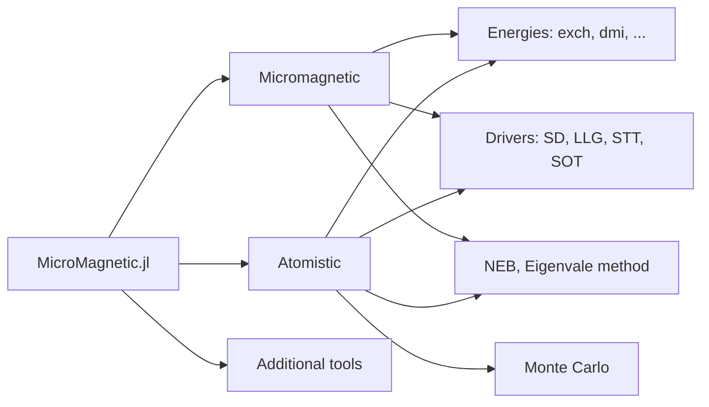

```@raw html
---
# https://vitepress.dev/reference/default-theme-home-page
layout: home

hero:
  name: "MicroMagnetic.jl"
  tagline: A Julia package for classical spin dynamics and micromagnetic simulations with GPU support.
  image: 
    src: /logo.png
    alt: MicroMagnetic
  actions:
    - theme: brand
      text: Get Started
      link: /basics
    - theme: alt
      text: API
      link: /api
    - theme: alt
      text: View on Github
      link: https://github.com/MagneticSimulation/MicroMagnetic.jl

<!-- FIXME: Need to update /MicroMagnetic.jl/dev/ to /MicroMagnetic.jl/v0.x.x when version upgrades -->
features:
  - icon: 
    title: Standard Problem 4
    details: Simulate the standard problem 4 using sim_with
    link: /micromagnetics/std4_sim_with
  - icon: 
    title: Standard Problem 5
    details: Vortex dynamics with spin transfer torques
    link: /micromagnetics/std5.md
  - icon: 
    title: Stoner–Wohlfarth model
    details: Compute Stoner–Wohlfarth loop using a particle
    link: /micromagnetics/stoner_wohlfarth
  - icon: 
    title: Skyrmion phases
    details: Compute skyrmion phases using stochastic LLG
    link: /atomistic/phase_diagram
  - icon: 
    title: Monte Carlo
    details: Compute M-T curve using monte carlo
    link: /monte_carlo/M_T_curve
  - icon: 
    title: Dynamical susceptibility
    details: Compute dynamical susceptibility of a naonbar
    link: /micromagnetics/chi


---

```

````@raw html
<p style="margin-bottom:2cm"></p>

<div class="vp-doc" style="width:80%; margin:auto">

<h1> Features </h1>
<ul>
  <li>Supports classical spin dynamics and micromagnetic simulations.</li>
  <li>Compatible with CPU and multiple GPU platforms, including NVIDIA, AMD, Intel, and Apple GPUs.</li>
  <li>Supports both double and single precision.</li>
  <li>Supports Monte Carlo simulations for atomistic models.</li>
  <li>Implements the Nudged-Elastic-Band method for energy barrier computations.</li>
  <li>Supports Spin-transfer torques, including Zhang-Li and Slonczewski models.</li>
  <li>Incorporates various energy terms and thermal fluctuations.</li>
  <li>Supports constructive solid geometry.</li>
  <li>Supports periodic boundary conditions.</li>
  <li>Easily extensible to add new features.</li>
</ul>

<h2> Quick start -- Standard Problem 4 </h2>

```julia
using MicroMagnetic
using CairoMakie

@using_gpu() # Import available GPU packages such as CUDA, AMDGPU, oneAPI, or Metal

mesh = FDMesh(; nx=200, ny=50, nz=1, dx=2.5e-9, dy=2.5e-9, dz=3e-9); # Define the discretization

sim = Sim(mesh; driver="SD", name="std4") #Create a simulation instance
set_Ms(sim, 8e5)        # Set saturation magnetization
add_exch(sim, 1.3e-11)  # Add exchange interaction
add_demag(sim)          # Add demagnetization

init_m0(sim, (1, 0.25, 0.1))  # Initialize magnetization
relax(sim; stopping_dmdt=0.01)  # Stage 1 : relax the system to obtain the "S" state

set_driver(sim; driver="LLG", alpha=0.02, gamma=2.211e5)
add_zeeman(sim, (-24.6mT, 4.3mT, 0))                # Stage 2: Apply external magnetic field
run_sim(sim; steps=100, dt=1e-11, save_m_every=1)   # Run the simulation for 100 steps

ovf2movie("std4_LLG"; output="std4.gif", component='x'); # Generate a movie
```

<h2> Structure of MicroMagnetic.jl </h2>



</div>
````
