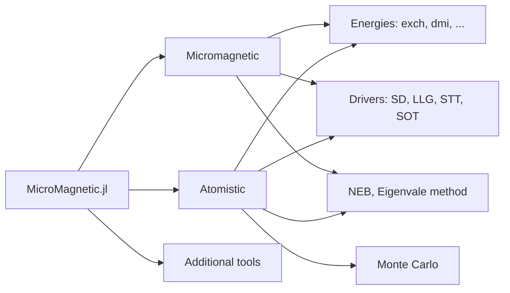

```@raw html
---
# https://vitepress.dev/reference/default-theme-home-page
layout: home

hero:
  name: "MicroMagnetic.jl"
  tagline: A Julia package for classical spin dynamics and micromagnetic simulations with GPU support.
  image: 
    src: /logo.png
    alt: MicroMagnetic
  actions:
    - theme: brand
      text: Get Started
      link: /basics
    - theme: alt
      text: API
      link: /api
    - theme: alt
      text: View on Github
      link: https://github.com/MagneticSimulation/MicroMagnetic.jl

<!-- FIXME: Need to update /MicroMagnetic.jl/dev/ to /MicroMagnetic.jl/v0.x.x when version upgrades -->
features:
  - icon: 
    title: Skyrmion phases
    details: Compute skyrmion phases using stochastic LLG
    link: /atomistic/phase_diagram
  - icon: 
    title: Distribution of magnetization
    details: Compute the distribution of magnetization using stochastic LLG
    link: /atomistic/sllg
  - icon: 
    title: Skyrmion phases
    details: Compute skyrmion phases using monte carlo
    link: /monte_carlo/skyrmion

  - icon: 
    title: Standard Problem 4
    details: Simulate the standard problem 4 using sim_with
    link: /micromagnetics/std4_sim_with
  - icon: 
    title: Stoner–Wohlfarth model
    details: Compute Stoner–Wohlfarth loop using a particle
    link: /micromagnetics/stoner_wohlfarth
  - icon: 
    title: Skyrmion lattice
    details: Relax the system to obtain the skyrmion lattices.
    link: /atomistic/skyrmion_lattice
---

```

````@raw html
<p style="margin-bottom:2cm"></p>

<div class="vp-doc" style="width:80%; margin:auto">

<h1> Features </h1>
<ul>
  <li>Supports classical spin dynamics and micromagnetic simulations.</li>
  <li>Compatible with CPU and multiple GPU platforms, including NVIDIA, AMD, Intel, and Apple GPUs.</li>
  <li>Supports both double and single precision.</li>
  <li>Supports Monte Carlo simulations for atomistic models.</li>
  <li>Implements the Nudged-Elastic-Band method for energy barrier computations.</li>
  <li>Supports Spin-transfer torques, including Zhang-Li and Slonczewski models.</li>
  <li>Incorporates various energy terms and thermal fluctuations.</li>
  <li>Supports constructive solid geometry.</li>
  <li>Supports periodic boundary conditions.</li>
  <li>Easily extensible to add new features.</li>
</ul>

<h2> Quick start </h2>
Assuming we have a cylindrical FeG sample with a diameter of 100 nm and a height of 40 nm, we want to know its magnetization distribution and the stray field around it. 
We can use the following script: 

```julia
using MicroMagnetic
@using_gpu() # Import available GPU packages such as CUDA, AMDGPU, oneAPI, or Metal

# Define simulation parameters
args = (
    task = "Relax", # Specify the type of simulation task (e.g., relaxation)
    mesh = FDMesh(nx=80, ny=80, nz=30, dx=2e-9, dy=2e-9, dz=2e-9), # Define the mesh grid for the simulation with 80x80x30 cells and 2 nm cell size
    shape = Cylinder(radius=50e-9, height=40e-9), # Define the shape of the magnetic structure as a cylinder with 50 nm radius and 40 nm height
    Ms = 3.87e5, # Set the saturation magnetization (A/m)
    A = 8.78e-12, # Set the exchange stiffness constant (J/m)
    D = 1.58e-3, # Set the Dzyaloshinskii-Moriya interaction constant (J/m^2)
    demag = true, # Enable demagnetization effects in the simulation
    m0 = (1,1,1), # Set the initial magnetization direction
    stopping_dmdt = 0.1 # Set the stopping criterion for the simulation based on the rate of change of magnetization dynamics
);

# Run the simulation with the specified parameters
sim = sim_with(args); 

# Save the magnetization and the stray field into vtk.
save_vtk(sim, "m_demag", fields=["demag"]) 
```
The magnetization and the stray field around the cylindrical sample are stored in `m_demag.vts`, which can be opened using Paraview. 


<h2> Structure of MicroMagnetic.jl </h2>



</div>
````
