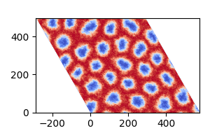

```@meta
ShareDefaultModule = true
```

# Skyrmion Phase using Monte Carlo

This example simulates the magnetic skyrmion phase using Monte Carlo methods.
The parameters for the system are taken from the paper:

- "Very large Dzyaloshinskii-Moriya interaction in two-dimensional Janus manganese dichalcogenides and its application to realize skyrmion states,"
  *Physical Review B*, vol. 101, p. 184401 (2020).

Here, we replicate the skyrmion phase of MnSTe shown in Figure 4 of the paper,
simulating at a temperature of 10K and an external field of 1.5T.

````@example
using MicroMagnetic
using NPZ

@using_gpu()  # Enable GPU acceleration if available.
````

Relaxation function to compute the skyrmion phase.

````@example
function relax_system(; Hz = 0.1)
    #Create a triangular mesh with periodic boundary conditions in the x and y directions.
    mesh = TriangularMesh(nx = 160, ny = 160, pbc = "xy")

    #Initialize the Monte Carlo simulation object.
    sim = MonteCarlo(mesh; name = "mc")

    #Set up the initial magnetization with random orientation.
    init_m0_random(sim)

    #Add simulation parameters:
    #Exchange interaction.
    add_exch(sim; J = 10.52 * meV)

    #Dzyaloshinskii-Moriya interaction (DMI).
    add_dmi(sim; D = 2.63 * meV, type = "interfacial")

    #Zeeman interaction with external field Hz.
    mu_s = 3.64 * mu_B  # Magnetic moment per spin.
    add_zeeman(sim; Hz = Hz * mu_s)

    #Uniaxial anisotropy.
    add_anis(sim; Ku = 0.29 * meV)

    #Perform high-temperature annealing to prepare the system.
    Ts = [100000, 1000, 500]  # Annealing temperatures (in K).
    for T in Ts
        sim.T = T
        run_sim(sim; max_steps = 10_000, save_vtk_every = -1, save_m_every = -1)
    end

    #Gradual cooling to reach the target temperature of 10K.
    for T in 100:-10:10
        sim.T = T
        run_sim(sim; max_steps = 50_000, save_vtk_every = -1, save_m_every = -1)
    end

    #Save the final results.
    save_vtk(sim, "final.vts")                  # Save magnetization as a VTK file.
    npzwrite("final_m.npy", Array(sim.spin))    # Save magnetization as a NumPy file.
end
````

Run the simulation with an external field of 1.5T.

```julia
relax_system(Hz = 1.5)
```

The final magnetization data is saved in "final.vts" and "final_m.npy".
You can visualize the results using ParaView or Python. Below is an example Python script:

```python
import numpy as np
import matplotlib.pyplot as plt
from matplotlib.transforms import Affine2D

# Load the magnetization data.
m = np.load("final_m.npy")
m = np.reshape(m, (3, 160, 160), order='F')  # Reshape to a 3x160x160 array.

dx = 3.6

# Plot the z-component of the magnetization (m_z).
fig, ax = plt.subplots(figsize=(3, 2))
im = ax.imshow(
    np.transpose(m[2, :, :]),
    extent=[0, 160 * dx, 0, 160 * dx * np.sqrt(3) / 2],
    origin='lower',
    cmap='coolwarm'
)

# Apply a skew transformation to create a hexagonal visualization.
transform = Affine2D().skew_deg(-30, 0) + ax.transData
im.set_transform(transform)

# Adjust the x-axis limits to center the visualization.
ax.set_xlim(-80 * dx, 160 * dx)

plt.tight_layout()
plt.savefig("final_m.png")
```

The plot should look like this:



