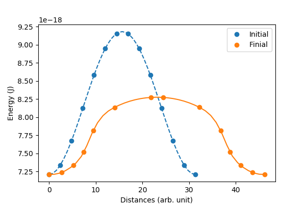

# Tutorial

## An example -- vortex

To start a micromagnetic simulation, we first create a FDMesh

```julia
mesh = FDMesh(dx=2e-9, dy=2e-9, dz=2e-9, nx=100, ny=100)
```

After that, we create a simulation

```julia
sim = Sim(mesh, name="vortex")
```

and set the damping to 0.5 and switch off the precession term in LLG equation:

```julia
sim.driver.alpha = 0.5
sim.driver.precession = false
```

The geometry of the system can be defined by

```julia
set_Ms(sim, circular_Ms)
```

where `circular_Ms` could be a scalar or a function. The function should take six parameters `(i,j,k,dx,dy,dz)`, for instance

```julia
function circular_Ms(i,j,k,dx,dy,dz)
    if (i-50.5)^2 + (j-50.5)^2 <= 50^2
        return 8.6e5
    end
    return 0.0
end
```

We add the exchange interaction and the demagnetization field to the system.

```julia
add_exch(sim, 1.3e-11)
add_demag(sim)
```

We need to initialise the system which can be done by defining a function

```julia
function init_fun(i,j,k,dx,dy,dz)
  x = i-50.5
  y = j-50.5
  r = (x^2+y^2)^0.5
  if r<5
    return (0,0,1)
  end
  return (y/r, -x/r, 0)
end
```

and using

```julia
init_m0(sim, init_fun)
```

To trigger the simulation we relax the system

```julia
relax(sim, maxsteps=1000)
```

## How to enable GPU

Using FDMeshGPU instead of FDMesh to switch on the GPU calculation,

```julia
mesh = FDMeshGPU(dx=2e-9, dy=2e-9, dz=2e-9, nx=100, ny=100)
```

The script to use GPU to obtain the vortex structure is shown below:

```julia
using JuMag
using Printf
using NPZ

JuMag.cuda_using_double(true)
mesh =  FDMeshGPU(dx=2e-9, dy=2e-9, dz=5e-9, nx=100, ny=100, nz=4)

function circular_Ms(i,j,k,dx,dy,dz)
    x = i-50.5
    y = j-50.5
    r = (x^2+y^2)^0.5
    if (i-50.5)^2 + (j-50.5)^2 <= 50^2
        return 8e5
    end
    return 0.0
end

function init_fun(i,j,k,dx,dy,dz)
  x = i-50.5
  y = j-50.5
  r = (x^2+y^2)^0.5
  if r<5
    return (0,0,1)
  end
  return (y/r, -x/r, 0)
end

function relax_system()
  sim = Sim(mesh, driver="SD", name="sim")
  set_Ms(sim, circular_Ms)

  add_exch(sim, 1.3e-11, name="exch")
  add_demag(sim)

  init_m0(sim, init_fun)
  relax(sim, maxsteps=2000, stopping_torque=1.0, save_vtk_every = 100, save_m_every=-1)
  npzwrite("m0.npy", sim.spin)
end

relax_system()
```

## Standard Problem #4

```julia
using JuMag
using Printf
using NPZ

mesh =  FDMeshGPU(nx=200, ny=50, nz=1, dx=2.5e-9, dy=2.5e-9, dz=3e-9)

function relax_system(mesh)
  sim = Sim(mesh, name="std4_relax", driver="SD")
  set_Ms(sim, 8.0e5)
  sim.driver.min_tau = 1e-10

  add_exch(sim, 1.3e-11)
  add_demag(sim)

  init_m0(sim, (1, 0.25, 0.1))

  relax(sim, maxsteps=5000, stopping_torque=10.0)
  npzwrite("m0.npy", Array(sim.spin))
end

function apply_field1(mesh)
  sim = Sim(mesh, name="std4_dyn")
  set_Ms(sim, 8.0e5)
  sim.driver.alpha = 0.02
  sim.driver.gamma = 2.211e5

  mT = 0.001 / (4*pi*1e-7)
  add_exch(sim, 1.3e-11)
  add_demag(sim)
  add_zeeman(sim, (-24.6*mT, 4.3*mT, 0))

  init_m0(sim, npzread("m0.npy"))

  for i=1:100
    run_until(sim, 1e-11*i)
  end
end

relax_system(mesh)
println("Start step2 !!!")
apply_field1(mesh)
println("Run step2 again!!!")
@time apply_field1(mesh)
println("Done!")
```

The output file is a simple text compatible with [Gnuplot](http://www.gnuplot.info/), like used for plot below.


## A NEB example (vortex core reversal)

The magnetic vortex core can either point up or point down. In this example, we will compute the energy barrier between this two states. We will use NEB (Nudged elastic band) method.

To begin, we need to prepare this two states which can be done by defining two initial functions `init_m_point_up` and `init_m_point_down`. After running the following script, two states in the format of OVF2 (`up.ovf` and `down.ovf`) will be saved.

```julia
using JuMag
using Printf

JuMag.cuda_using_double(true)
mesh =  FDMeshGPU(dx=2e-9, dy=2e-9, dz=5e-9, nx=100, ny=100, nz=4)

function circular_Ms(i,j,k,dx,dy,dz)
    x = i-50.5
    y = j-50.5
    r = (x^2+y^2)^0.5
    if (i-50.5)^2 + (j-50.5)^2 <= 50^2
        return 8e5
    end
    return 0.0
end

function init_m_point_up(i,j,k,dx,dy,dz)
  x = i-50.5
  y = j-50.5
  r = (x^2+y^2)^0.5
  if r<5
    return (0,0,1)
  end
  return (y/r, -x/r, 0)
end

function init_m_point_down(i,j,k,dx,dy,dz)
  x = i-50.5
  y = j-50.5
  r = (x^2+y^2)^0.5
  if r<5
    return (0,0,1)
  end
  return (y/r, -x/r, 0)
end

function relax_system(init_fun, name)
  sim = Sim(mesh, driver="SD", name="sim")
  set_Ms(sim, circular_Ms)

  add_exch(sim, 1.3e-11, name="exch")
  add_demag(sim)

  init_m0(sim, init_fun)
  relax(sim, maxsteps=2000, stopping_torque = 1.0)
  save_ovf(sim, name)
end

for (init_m, name) in [(init_m_point_up, "up"), (init_m_point_down, "down")]
  relax_system(init_m, name)
end
```

After generating the two states we are interested in, we can use NEB method. In JuMag, we have a pure CPU version of NEB and a GPU version which supports multiple GPUs with the helper of MPI. In this example, we will use the latter, i.e., `NEB_MPI`. Typically, three parameters are needed to start the NEB simulation:

- sim -- an instance of MicroSimGPU.
- init_m -- an array that contains at least two ends states. If you have more information about the middle states, you can put it into init_m array.
- interpolations -- an array to contain the number of interpolations between given states. So length(interpolations) must equal to length(init_m) - 1.

So the typical usage is given as follows

```
function relax_neb()
    ovf1 = read_ovf("down.ovf")
    ovf2 = read_ovf("up.ovf")
    sim = create_sim()
    init_m = [ovf1.data, ovf2.data]
    interpolations = [12]
    neb = NEB_MPI(sim, init_m, interpolations, driver="LLG")
    relax(neb, maxsteps=10000, stopping_dmdt = 0.5, save_ovf_every=500)
end
```

In the function `relax_neb` we called `create_sim` which is very similar to the function `relax_system`, actually, two functions should have exactly the same micromagnetic parameters. Here, to save GPU memory we do not use any driver (by setting `driver="none"`) and let `save_data=false` when creating the Sim instance.

```
function create_sim()
    mesh =  FDMeshGPU(dx=2e-9, dy=2e-9, dz=5e-9, nx=100, ny=100, nz=4)
    sim = Sim(mesh, name="sim", driver="none", save_data=false)
    set_Ms(sim, circular_Ms)
    init_m0(sim, (0,0,1))
    add_demag(sim)
    add_exch(sim, 1.3e-11)
    return sim
end
```

Moreover, if you are going to use multiple GPUs, you need to add `JuMag.using_multiple_gpus()`, the number of GPUs will be set to the number of processes of MPI. Put it all together, the script is given by

```
using JuMag
using CuArrays
using Printf
JuMag.cuda_using_double(true)
CuArrays.allowscalar(false)  #important for performance

JuMag.using_multiple_gpus()

function create_sim()
    mesh =  FDMeshGPU(dx=2e-9, dy=2e-9, dz=5e-9, nx=100, ny=100, nz=4)
    sim = Sim(mesh, name="sim", driver="none", save_data=false)
    set_Ms(sim, circular_Ms)
    init_m0(sim, (0,0,1))
    add_demag(sim)
    add_exch(sim, 1.3e-11)
    return sim
end

function circular_Ms(i,j,k,dx,dy,dz)
    x = i-50.5
    y = j-50.5
    r = (x^2+y^2)^0.5
    if (i-50.5)^2 + (j-50.5)^2 <= 50^2
        return 8e5
    end
    return 0.0
end

function relax_neb()
    ovf1 = read_ovf("vortex_down.ovf")
    ovf2 = read_ovf("vortex_up.ovf")
    sim = create_sim()
    neb = NEB_MPI(sim,(ovf1.data, ovf2.data),(12), driver="LLG")
    relax(neb, maxsteps=10000, stopping_dmdt=1.0, save_ovf_every=500)
end

relax_neb()
```

The Slurm script two use two GPUs:

```
#!/bin/bash
#SBATCH --nodes=1             # Number of nodes
#SBATCH --ntasks=2            # Number of MPI processes
#SBATCH --cpus-per-task=1     # Number of CPUs per task
#SBATCH --gres=gpu:2          # Number of GPUs
mpiexec -np 2 julia main.jl
```



## Monte Carlo (M-T curve)

We can use Monte Carlo to compute the M-T curve. For the atomistic model with $z$ nearest neighbors, the relation between exchange constant and $T_c$ reads [^1]

```math
J = \frac{3 k_B T_c}{ \epsilon z }
```

where $\epsilon$ is a correction factor. For 3D classical Heisenberg model $\epsilon \approx 0.719$. In this example, we will assume $J=300k_B$ which gives $T_c = 431 K$. The full script is shown below.

```julia
using JuMag
using Random

JuMag.cuda_using_double(true)

function relax_system(T)
  mesh =  CubicMeshGPU(nx=30, ny=30, nz=30, pbc="xyz")
  sim = MonteCarloNew(mesh, name="mc")
  init_m0(sim, (0,0,1))

  add_exch(sim, J=300*k_B)
  add_dmi(sim, D=0, D1=0)
  add_zeeman(sim, Hx=0, Hy=0, Hz=0)
  add_anis(sim, Ku=0, Kc=0)

  sim.T = 100000
  run_sim(sim, maxsteps=50000, save_vtk_every=-1, save_m_every=-1)
  sim.T = T
  run_sim(sim, maxsteps=200000, save_vtk_every=-1, save_m_every=-1)

  ms = zeros(1000)
  sim.T = T
  for i = 1:1000
      run_sim(sim, maxsteps=100, save_vtk_every=-1, save_m_every=-1)
      t = JuMag.average_m(sim)
      ms[i] = sqrt(t[1]^2+t[2]^2+t[3]^2)
  end
  return sum(ms)/length(ms)
end

f = open("M_H.txt", "w")
write(f, "#T(K)     m \n")
for T = 10:20:500
    println("Running for $T ...")
    m = relax_system(T)
    write(f, "$T    $m \n")
end
close(f)
```

The obtained M-T curve is shown as follows, where the obtained $T_c$ is closed to 440 K.s 

[^1] Atomistic spin model simulations of magnetic nanomaterials, J. Phys.: Condens. Matter 26 (2014) 103202.
