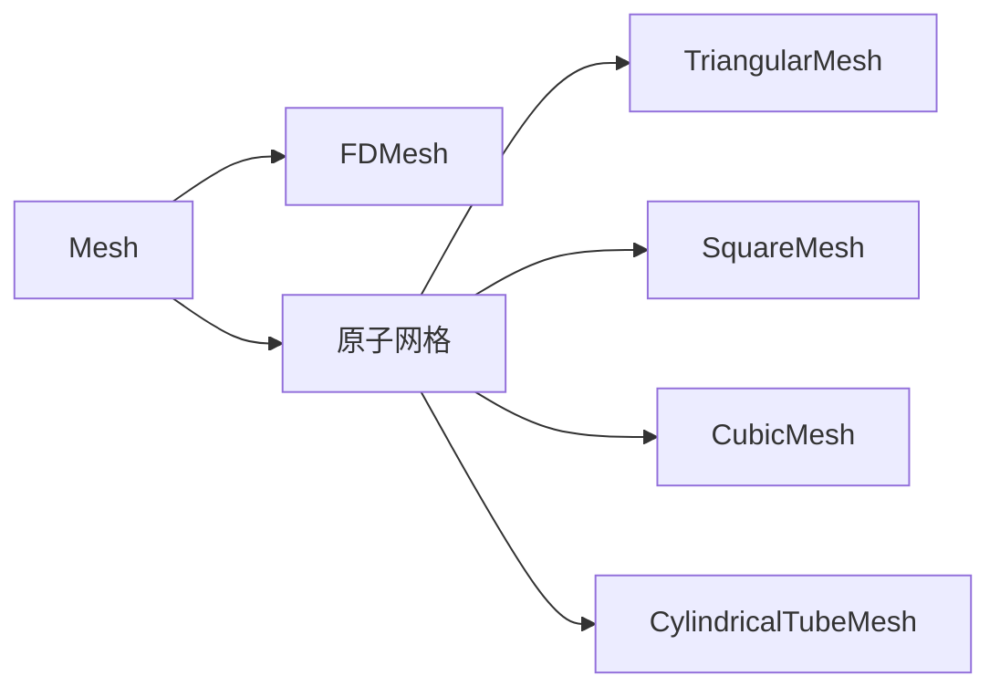
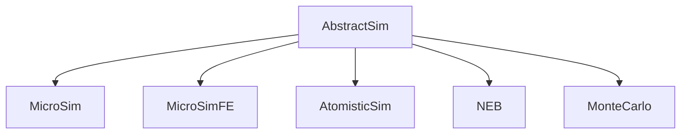
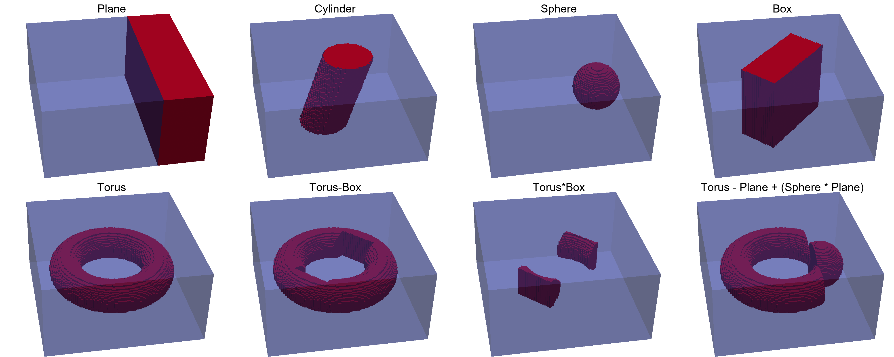
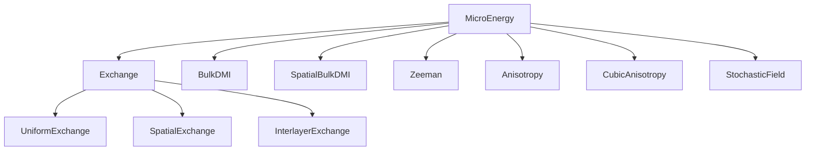
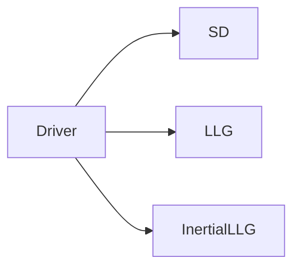

# 基础

## 网格

MicroMagnetic 使用有限差分方法对微磁能量进行离散化。在 MicroMagnetic 中，离散网格信息
存储在 [`FDMesh`](@ref) 中。因此在开始模拟之前，需要先创建网格。

```julia
mesh = FDMesh(;dx=1e-9, dy=1e-9, dz=1e-9, nx=1, ny=1, nz=1)
```

实际上，[`FDMesh`](@ref) 用于微磁模拟；对于原子模型，可以使用 [`CubicMesh`](@ref)、[`TriangularMesh`](@ref)、[`CylindricalTubeMesh`](@ref) 等。




## Sim

MicroMagnetic 针对不同的计算体系和问题类型提供了不同的 Sim 对象。框架定义了五种主要模拟类型，继承结构如下：



对于 [MicroSim](@ref MicroMagnetic.MicroSim) 和 [AtomisticSim](@ref MicroMagnetic.AtomisticSim)，使用 `Sim` 构造器创建模拟，然后逐步设置材料参数并添加能量项。

### 示例：创建模拟

```julia
sim = Sim(mesh; driver="SD", name="std4")

set_Ms(sim, 8e5)           # 设置饱和磁化强度
add_exch(sim, 1.3e-11)     # 添加交换相互作用
add_demag(sim)             # 添加退磁场
init_m0(sim, (1, 0.25, 0.1))  # 初始化磁化
```

所有模拟数据都可以通过 `sim` 对象访问，磁化分布随时可以从 `sim.spin` 获取。

!!! note "从 `create_sim` 迁移（v0.7.0 中已移除）"
    `create_sim(mesh; Ms=..., A=..., ...)` 在 v0.6.0 中被弃用，并在 v0.7.0 中被彻底移除。
    请使用上面展示的 `Sim` 构造器搭建模拟——每个关键字对应一个显式调用
    （`Ms` → `set_Ms`，`A` → `add_exch`，`demag` → `add_demag`，`m0` → `init_m0` 等）；
    或者当配置需要直接执行时，使用高层接口 [`sim_with`](@ref)。

!!! note
    默认情况下，磁化存储为一维数组，形式为 ``[m_{1,x}, m_{1, y}, m_{1, z}, ..., m_{n,x}, m_{n, y}, m_{n, z}]``，可以重塑为 4 维数组
    ```julia
    m = reshape(sim.spin, 3, nx, ny, nz)
    mx = m[1, :, :, :]
    my = m[2, :, :, :]
    mz = m[3, :, :, :]
    ```

## 函数式参数

在 MicroMagnetic 中，所有参数都可以用函数来设置。例如，可以用 [`set_Ms`](@ref) 函数设置体系的饱和磁化强度。若材料均匀，Ms 为标量，可以这样设置：
```julia
set_Ms(sim, 8.6e5)
```
此外，也可以传入函数来设置：
```julia
function circular_Ms(i,j,k,dx,dy,dz)
    if (i-50.5)^2 + (j-50.5)^2 <= 50^2
        return 8.6e5
    end
    return 0.0
end
set_Ms(sim, circular_Ms)
```
或者，`circular_Ms` 函数也可以接受三个坐标参数：

```julia
function circular_Ms(x, y, z)
    if x^2 + y^2 <= (50nm)^2
        return 8.6e5
    end
    return 0.0
end
set_Ms(sim, circular_Ms)
```

注意，我们创建的网格其实是一个规则的长方体，但实际样品的形状未必是长方体。以圆盘为例，可以让圆盘之外的区域 Ms 为 0，以此定义模拟体系的形状。请注意，MicroMagnetic 中几乎所有设置函数都
接受函数作为输入。这种基于单元的方式最大限度地提供了灵活性，可用于定义形状、定义多种材料等。

## 形状

### 基本形状

除了用函数定义形状之外，对于一些规则形状及其组合，可以利用 MicroMagnetic 定义的基本形状和布尔运算来实现。MicroMagnetic 支持 Plane、Cylinder、Sphere、Box、Torus 等基本形状。

!!! note 
    | **运算符** | **布尔运算** |
    | :----------: | :-------------------: |
    | +            | 并集                  |
    | -            | 差集                  |
    | *            | 交集                  |

示例：
```julia
using MicroMagnetic

mesh = FDMesh(dx=2e-9, dy=2e-9, dz=2e-9, nx=100, ny=100, nz=50)

p1 = Plane(point=(40e-9,0,0), normal=(1, 0, 0))
save_vtk(mesh, p1, "shape1")

c1 = Cylinder(radius=30e-9, normal=(0.3,0,1))
save_vtk(mesh, c1, "shape2")

s1 = Sphere(radius = 30e-9, center=(50e-9, 0, 0))
save_vtk(mesh, s1, "shape3")

b1 = Box(sides = (110e-9, 50e-9, Inf), theta=pi/4)
save_vtk(mesh, b1, "shape4")

t1 = Torus(R = 60e-9, r=20e-9)
save_vtk(mesh, t1, "shape5")

t2 = t1 - b1 
save_vtk(mesh, t2, "shape6")

t3 = t1 * b1 
save_vtk(mesh, t3, "shape7")

t4 = t1 - p1 + (s1 * p1)
save_vtk(mesh, t4, "shape8")
```
保存的 vts 文件可以用 Paraview 等程序可视化，如下所示：



创建的形状可以用来设置参数，例如
```julia
set_Ms(sim::AbstractSim, geo::Shape, Ms::Number)
```

## 能量项

创建 Sim 之后，就可以调用函数添加模拟中需要考虑的能量项。例如 add_zeeman、add_exch、add_dmi、add_demag
分别添加 Zeeman 能、交换相互作用能、DMI 能和退磁场能。

注意
```julia
sim = Sim(mesh; driver="SD")
set_Ms(sim, 8e5)
add_exch(sim, 1.3e-11)
```
和
```julia
sim = Sim(mesh; driver="SD")
set_Ms(sim, 8e5)

ex = add_exch(sim, 1.3e-11)
```
是等价的。后者的优点是：当需要交换相互作用的数据时，可以直接通过 `ex` 访问。

MicroMagnetic 实现了以下能量项 




## 驱动



STT 和 SOT 不是独立的驱动，而是施加在 LLG 上的力矩项（`add_stt` / `add_sot`）。
`alpha` 既可以取标量，也可以取逐格点的数组（见 `set_alpha`）。

## 周期性边界条件

`FDMesh` 通过 `pbc` 关键字开启周期性边界条件，取值为 `'x'`、`'y'`、`'z'` 的任意组合
（默认 `"open"`，即开放边界）。例如二维周期边界：

```julia
mesh = FDMesh(dx=2.5e-9, dy=2.5e-9, dz=3e-9, nx=100, ny=50, nz=1, pbc="xy")
```

周期边界会影响交换、DMI 等近邻相互作用；对退磁场，周期化处理由网格自动驱动，
详情见 `FDMesh` 的文档字符串。

## 高层接口

**MicroMagnetic.jl** 提供了一个名为 `sim_with` 的高层接口，用于简化微磁模拟的搭建与执行。该函数允许把所有相关的微磁参数打包成一个 `NamedTuple` 或 `Dict`，直接传给 `sim_with`。这种方式使模拟搭建更加简洁、直观、灵活。

### 示例：磁滞回线计算

下面演示如何用 `sim_with` 计算磁滞回线。参数既可以用 `NamedTuple`，也可以用 `Dict` 定义。

```julia
using MicroMagnetic

# 使用 NamedTuple
args = (
    task = "Relax",
    mesh = FDMesh(nx=50, ny=10, nz=1, dx=2.5e-9, dy=2.5e-9, dz=2.5e-9),
    Ms = 8e5, 
    A = 1.3e-11,
    demag = true,
    m0 = (-1, 0, 0),
    stopping_dmdt = 0.01,
    H_s = [(i*50mT, i*50mT, 0) for i=-20:20]
)

sim_with(args)

# 使用 Dict
args = Dict(
    :task => "Relax",
    :mesh => FDMesh(nx=50, ny=10, nz=1, dx=2.5e-9, dy=2.5e-9, dz=2.5e-9),
    :Ms => 8e5, 
    :A => 1.3e-11,
    :demag => true,
    :m0 => (-1, 0, 0),
    :stopping_dmdt => 0.01,
    :H_s => [(i*50mT, i*50mT, 0) for i=-20:20]
)

sim_with(args)
```

在这些示例中，外磁场 `H` 通过 `_s` 后缀（或 `_sweep`）进行扫描。目前允许使用该后缀的键只有
`task`（如 "Relax" / "Dynamics"）、`driver`（如 "SD" / "LLG"）、`Ms`（饱和磁化强度）和 `H`
（外磁场）；其他键（如 `A`、`Ku`、`D`）不能扫描，传入未知的键会直接报错。

### 示例：标准问题 4

**MicroMagnetic.jl** 支持常见的微磁任务，例如 **Relax**（寻找稳定的磁化组态）和
**Dynamics**（模拟磁化的时间演化）。下面的示例依次执行这两个任务。

```julia
args = (
    name = "std4",
    task_s = ["relax", "dynamics"],       # 任务列表
    mesh = FDMesh(nx=200, ny=50, nz=1, dx=2.5e-9, dy=2.5e-9, dz=3e-9),
    Ms = 8e5,                                 # 饱和磁化强度
    A = 1.3e-11,                              # 交换常数
    demag = true,                             # 启用退磁场
    m0 = (1, 0.25, 0.1),                      # 初始磁化
    alpha = 0.02,                             # Gilbert 阻尼
    steps = 100,                              # 动力学步数
    dt = 0.01ns,                              # 步长
    stopping_dmdt = 0.01,                     # 弛豫停止判据
    dynamic_m_every = 1,                      # 每步保存磁化
    H_s = [(0,0,0), (-24.6mT, 4.3mT, 0)]      # 外磁场序列
)

sim_with(args)
```

在这个例子中，系统先弛豫到稳定组态，然后在外磁场下模拟磁化动力学。通过 `NamedTuple` 或 `Dict`
传参，只需几行代码就能探索各种微磁场景，使 `sim_with` 成为微磁学研究与开发的有力工具。

## 数据表

默认输出是一个包含时间以及平均磁化、微磁总能量等信息的表。例如标准问题 4 的典型输出文件 std4_llg.txt 如下：
```bash
#               step                time             E_total                 m_x                 m_y                 m_z              E_exch             E_demag           zeeman_Hx           zeeman_Hy           zeeman_Hz            E_zeeman 
#         <unitless>                 <s>                 <J>          <unitless>          <unitless>          <unitless>                 <J>                 <J>               <A/m>               <A/m>               <A/m>                 <J> 
                 0 +0.000000000000e+00 +4.115051854628e-18 +9.667212580262e-01 +1.257338112913e-01 -7.385005331088e-14 +9.037089803430e-20 +5.385778227602e-19 -1.957605800030e+04 +3.421831276476e+03                  0 +3.486103133834e-18 
                 1 +1.000000000000e-11 +4.114333464830e-18 +9.639179728939e-01 +1.351913897494e-01 -1.250730661783e-02 +9.462544896467e-20 +5.500491422752e-19 -1.957605800030e+04 +3.421831276476e+03                  0 +3.469658873590e-18 
                 2 +2.000000000000e-11 +4.111801776628e-18 +9.551564239768e-01 +1.622306459477e-01 -2.438419245932e-02 +1.068628783479e-19 +5.850504604422e-19 -1.957605800030e+04 +3.421831276476e+03                  0 +3.419888437838e-18 
                 3 +3.000000000000e-11 +4.105969312986e-18 +9.390555926959e-01 +2.048856549742e-01 -3.536001067826e-02 +1.257008993481e-19 +6.473045240481e-19 -1.957605800030e+04 +3.421831276476e+03                  0 +3.332963889590e-18 
                 4 +4.000000000000e-11 +4.095848754295e-18 +9.138819844184e-01 +2.603015538941e-01 -4.514306950195e-02 +1.488766054551e-19 +7.426421285983e-19 -1.957605800030e+04 +3.421831276476e+03                  0 +3.204330020242e-18 
                 5 +5.000000000000e-11 +4.081051470750e-18 +8.781758247793e-01 +3.249452438428e-01 -5.352916374499e-02 +1.740004133747e-19 +8.761719462188e-19 -1.957605800030e+04 +3.421831276476e+03                  0 +3.030879111157e-18 
                 6 +6.000000000000e-11 +4.061691865398e-18 +8.310929541279e-01 +3.950519627725e-01 -6.053913609321e-02 +1.994187817227e-19 +1.050348598931e-18 -1.957605800030e+04 +3.421831276476e+03                  0 +2.811924484744e-18 
                 7 +7.000000000000e-11 +4.038094515872e-18 +7.723089438169e-01 +4.670888629588e-01 -6.648801333991e-02 +2.251205085123e-19 +1.264426321284e-18 -1.957605800030e+04 +3.421831276476e+03                  0 +2.548547686076e-18 
                 8 +8.000000000000e-11 +4.010448851303e-18 +7.016388084672e-01 +5.379604799389e-01 -7.195373892384e-02 +2.514962280097e-19 +1.516889929610e-18 -1.957605800030e+04 +3.421831276476e+03                  0 +2.242062693683e-18 
                 9 +9.000000000000e-11 +3.978492775965e-18 +6.185749984028e-01 +6.048546363741e-01 -7.770725658904e-02 +2.792453923841e-19 +1.806836879936e-18 -1.957605800030e+04 +3.421831276476e+03                  0 +1.892410503645e-18 
                10 +1.000000000000e-10 +3.941195510354e-18 +5.219398286586e-01 +6.647281597038e-01 -8.465287207565e-02 +3.110925716068e-19 +2.132894634005e-18 -1.957605800030e+04 +3.421831276476e+03                  0 +1.497208304741e-18 
    
```

我们提供 `read_table` 函数来读取 `std4_llg.txt` 中的表：
```julia
data, units = read_table("std4_llg.txt")
```
`data` 和 `units` 都是 Dict 对象，可以方便地访问数据。例如用 data["time"] 和 data["m_x"]
访问时间和磁化分量。这样就能轻松绘制结果，如下例所示：
```julia
using MicroMagnetic
using CairoMakie
function plot_m_ts()
    #载入数据
    data, unit = read_table("std4_llg.txt")

    #创建画布
    fig = Figure(size=(800, 480))
    ax = Axis(fig[1, 1], xlabel="Time (ns)", ylabel="m")

    #绘制 MicroMagnetic 结果
    scatter!(ax, data["time"] * 1e9, data["m_x"], markersize=6, label="m_x")
    scatter!(ax, data["time"] * 1e9, data["m_y"], markersize=6, label="m_y")
    scatter!(ax, data["time"] * 1e9, data["m_z"], markersize=6, label="m_z")

    #添加图例
    axislegend()

    save("mxyz.pdf", fig)

    return fig
end
```

## 自定义输出表

如果想在模拟过程中保存其他物理量，可以创建 `SaverItem` 并追加到默认 saver 上。例如，要计算并保存磁化的导引中心，可以这样写：

```julia
item = SaverItem(("Rx", "Ry"), ("<m>", "<m>"), compute_guiding_center)
push!(sim.saver.items, item)
```

如果使用 `sim_with` 或 `run_sim`，也可以把 `SaverItem` 直接作为参数传入：

```julia
run_sim(sim, saver_item=item)
```

这样就可以在标准模拟数据之外，把感兴趣的物理量（例如导引中心）一并输出。

## 计时 

MicroMagnetic.jl 使用 TimerOutputs.jl 来测量各个任务的执行时间。模拟运行之后，
测量结果存储在 `MicroMagnetic.timer` 中，因此只需

```julia
println(MicroMagnetic.timer)
```

即可显示计时信息。典型输出如下：

```bash
 ────────────────────────────────────────────────────────────────────────────────────
                                            Time                    Allocations
                                   ───────────────────────   ────────────────────────
         Tot / % measured:              16.1s /  82.8%            705MiB /  92.4%

 Section                   ncalls     time    %tot     avg     alloc    %tot      avg
 ────────────────────────────────────────────────────────────────────────────────────
 run_until                    101    12.8s   95.8%   127ms    632MiB   97.1%  6.26MiB
   demag                    25.1k    8.83s   66.2%   351μs    341MiB   52.4%  13.9KiB
   exch                     25.1k    780ms    5.8%  31.0μs   72.5MiB   11.1%  2.95KiB
   zeeman                   25.1k    523ms    3.9%  20.8μs   46.0MiB    7.1%  1.87KiB
   compute_system_energy      101   42.3ms    0.3%   419μs   1.93MiB    0.3%  19.5KiB
 run_step                     366    322ms    2.4%   880μs   12.7MiB    2.0%  35.6KiB
   demag                      366    191ms    1.4%   521μs   5.60MiB    0.9%  15.7KiB
   exch                       366   20.2ms    0.2%  55.3μs   1.12MiB    0.2%  3.14KiB
 compute_system_energy        367    232ms    1.7%   632μs   6.41MiB    1.0%  17.9KiB
 ────────────────────────────────────────────────────────────────────────────────────
```

注意：我们已经移除了所有显式同步，因此对 GPU 后端，各分项的计时并不精确。
