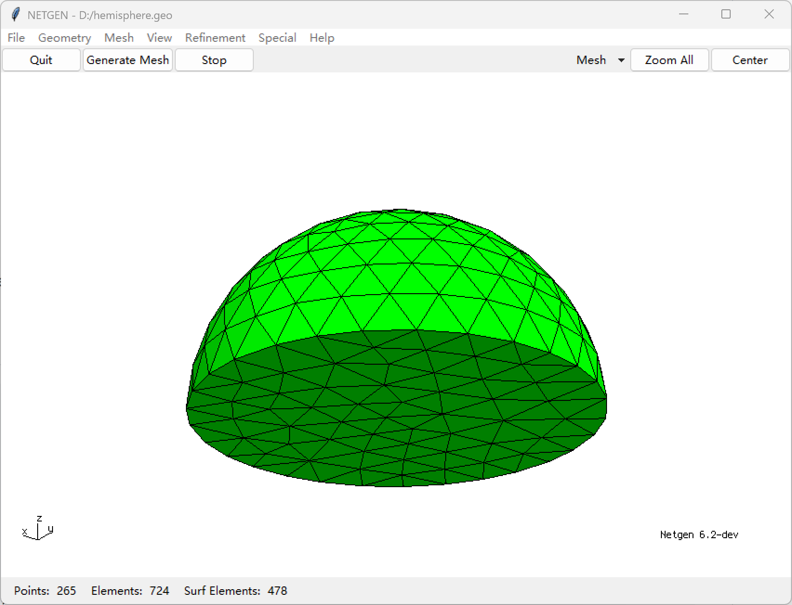
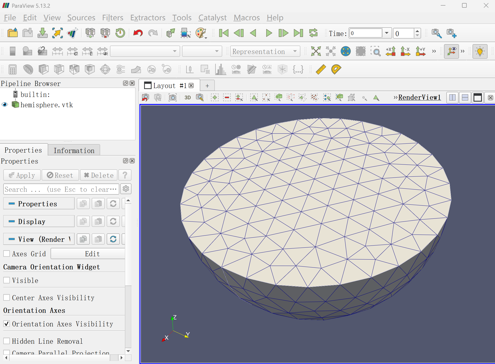

## 有限元

有限元微磁学的第一步也是最关键的一步是**网格生成**。
有多种软件可用于网格生成，这里介绍两种主要选择：

### 1. Netgen
- **代码仓库**：[https://github.com/NGSolve/netgen](https://github.com/NGSolve/netgen)
- **文档**：[https://github.com/NGSolve/netgen/blob/master/doc/ng4.pdf](https://github.com/NGSolve/netgen/blob/master/doc/ng4.pdf)
  
**典型用法**（创建半球）：
```text
algebraic3d

solid hemisphere = sphere (1, 0, 0; 10) and plane (1, 0, 0; 0, 0, -1);

tlo hemisphere -maxh=2.0;
```
 
```@raw html

```

*MicroMagnetic.jl* 原生支持 Netgen 的 Neutral 格式。

### 2. Gmsh
- **网站**：[https://gmsh.info/](https://gmsh.info/)
- **教程**：[https://gmsh.info/dev/doc/texinfo/gmsh.html#Gmsh-tutorial](https://gmsh.info/dev/doc/texinfo/gmsh.html#Gmsh-tutorial)

Gmsh 支持 OpenCASCADE 几何内核，可以直接创建复杂形状。下面是一个修改过的 Julia 示例，生成同样的半球并导出为 Gmsh 格式：

```julia
using Gmsh

gmsh.initialize()
gmsh.model.add("hemisphere")

# 创建球体和切割盒
sphere_tag = gmsh.model.occ.addSphere(1, 0, 0, 10)
box_tag = gmsh.model.occ.addBox(-100, -100, 0, 200, 200, 100)  # 大切割盒

# 执行布尔切割运算
hemisphere, _ = gmsh.model.occ.cut(
    [(3, sphere_tag)],  # 原始球体 (dim=3)
    [(3, box_tag)]      # 切割工具 (dim=3)
)
gmsh.model.occ.synchronize()

# 按尺寸约束生成网格
gmsh.option.setNumber("Mesh.MeshSizeMax", 2.0)
gmsh.model.mesh.generate(3)

# 导出为 Gmsh 格式
gmsh.write("hemisphere.msh")
gmsh.write("hemisphere.vtk")
gmsh.finalize()
```

生成的 vtk 文件可以用 Paraview 打开，如下所示：
  
