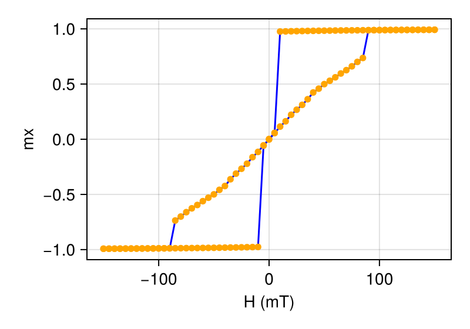

```@meta
ShareDefaultModule = true
```

# 薄盘磁滞回线

本示例演示如何用 **MicroMagnetic.jl** 模拟薄圆盘的磁滞回线。我们先创建圆柱薄盘样品，
再施加磁场扫描研究其磁滞行为。磁盘在磁化过程中表现出偏转的类涡旋组态。

导入所需模块并启用 GPU 加速（可选）。

````julia
using MicroMagnetic
using CairoMakie

#@using_gpu()
#using CUDSS # 求解线性方程组需要 CUDSS
````

## 第一步：定义体系几何

用 netgen 创建半径 100 nm、厚度 20 nm 的圆柱薄盘：

````julia
algebraic3d

solid fincyl = cylinder ( 0, 0, 1; 0, 0, -1; 100.0 )
    and plane (0, 0, -10; 0, 0, -1)
    and plane (0, 0, 10; 0, 0, 1) -maxh = 5;

tlo fincyl;
````

## 第二步：搭建模拟

创建使用 LLG 驱动的模拟，并用沿 x 负方向的均匀磁化初始化体系。

推荐使用 BS23 或 GPSM 积分器。以下代码使用 BS23：

````julia
function setup_simulation()
    mesh = FEMesh("./meshes/nanodot.mesh", unit_length=1e-9)
    sim = Sim(mesh, driver="LLG", integrator="BS23", name="disk")

    sim.driver.alpha = 0.5
    sim.driver.integrator.tol = 1e-6

    set_Ms(sim, 8e5)

    init_m0(sim, (-1, 0, 0))

    # 添加相互作用
    add_exch(sim, 1.3e-11)
    add_demag(sim)

    # 添加初始零场
    add_zeeman(sim, (0, 0, 0))

    return sim
end

# 创建模拟实例
sim = setup_simulation();
````

GPSM 积分器的典型设置：

````julia
function setup_simulation()
    mesh = FEMesh("./meshes/nanodot.mesh", unit_length=1e-9)
    sim = Sim(mesh, driver="LLG", integrator="GPSM", name="disk")

    sim.driver.alpha = 0.5
    sim.driver.integrator.step = 1e-12 # 每步 1ps

    set_Ms(sim, 8e5)

    init_m0(sim, (-1, 0, 0))

    # 添加相互作用
    add_exch(sim, 1.3e-11)
    add_demag(sim)

    # 添加初始零场
    add_zeeman(sim, (0, 0, 0))

    return sim
end

# 创建模拟实例
sim = setup_simulation();
````

## 第三步：计算磁滞回线

沿 x 方向施加从 -150 mT 到 150 mT 的磁场扫描。

````julia
# 定义磁场扫描（从 -150 mT 到 100 mT，步长 5 mT）
Hs = [i*mT for i=-150:5:150]

# 计算磁滞回线
hysteresis(sim, Hs, direction=(1, 0, 0), full_loop=false, stopping_dmdt=0.05, output="vtu")
nothing #hide
````

## 第四步：结果可视化

用模拟生成的数据绘制磁滞回线。

````julia
using MicroMagnetic
using CairoMakie
fig = plot_ts("disk_llg.txt", x_key="Hx", ["m_x"], x_unit=1/mT, xlabel="H (mT)", ylabel="m", mirror_loop=true);
````

````@raw html

````

可以下载本例使用的完整模拟脚本：

```@raw html
<a href="https://raw.githubusercontent.com/MagneticSimulation/MicroMagnetic.jl/master/docs/src/fem/hysteresis.jl" download>Download hysteresis.jl</a>
```

有限差分版本见 https://github.com/MagneticSimulation/MicroMagnetic.jl/blob/master/docs/tutorials/hysteresis/loop.jl
