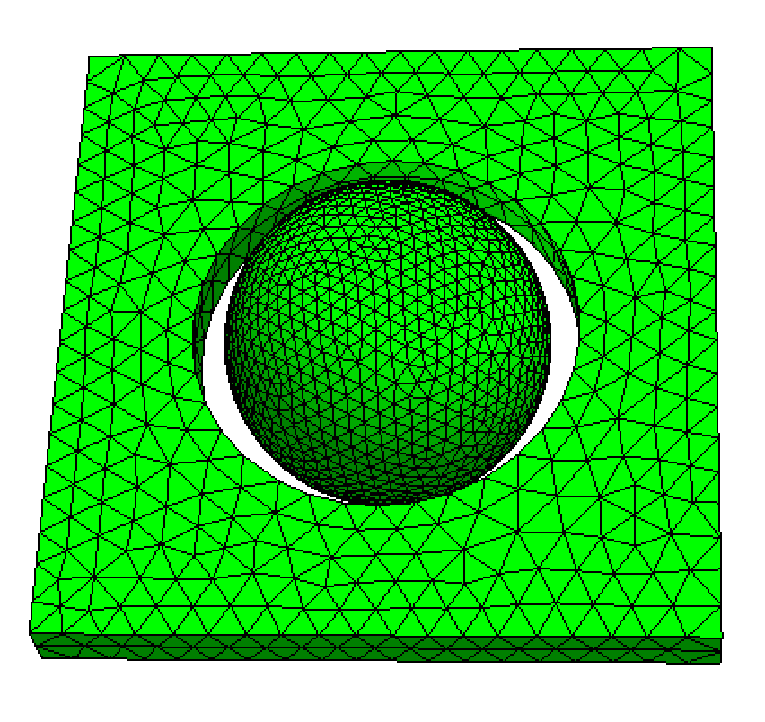
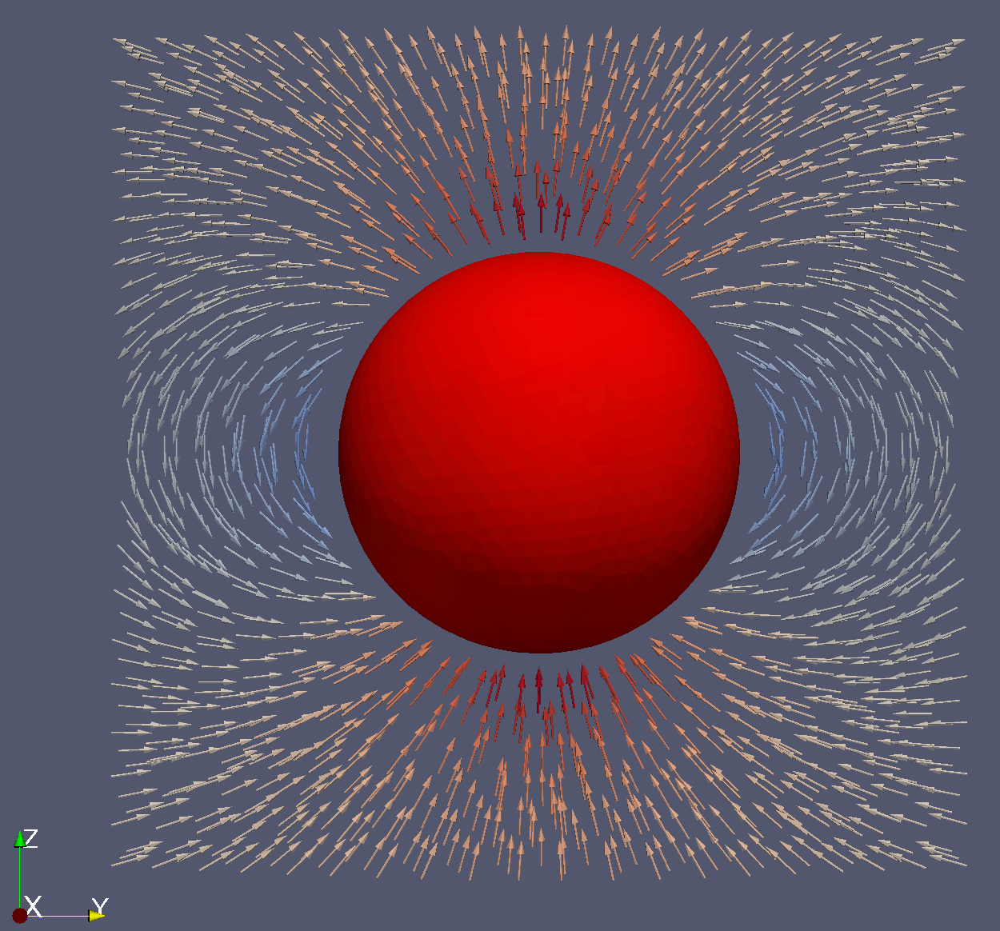

```@meta
ShareDefaultModule = true
```

# 均匀磁化球内部及周围的退磁场

本例使用有限元方法（FEM）计算均匀磁化球内部及其周围的退磁场。
众所周知，对于磁化为 $\mathbf{M} = M_s \mathbf{e}_z$ 的均匀磁化球，球内部磁场为：

```math
\mathbf{H}_{\text{int}} = -\frac{1}{3} \mathbf{M} = -\frac{1}{3} M_s \mathbf{e}_z
```

球外部的场等效于磁矩为 $\mathbf{m} = \mathbf{M} V$ 的磁偶极子产生的场，
其中 $V=\frac{4}{3} R_0^3$ 是球的体积。

相应的磁标势 $\phi_m$ 满足：

```math
\phi_m(\mathbf{r}) = 
\begin{cases}
\frac{1}{3} \mathbf{M} \cdot \mathbf{R} & \text{球内} \\
\frac{1}{3} \frac{R_0^3}{R^3} \mathbf{M} \cdot \mathbf{R} & \text{球外}
\end{cases}
```

先用 Netgen 生成模拟网格。下面的 `sphere_air.geo` 文件定义了几何：

```
algebraic3d

solid sp = sphere(0, 0, 0; 10);

solid air = orthobrick(-2,-20,-20; 2, 20, 20) and not sphere(0, 0, 0; 12);

tlo sp -maxh=1.0;

tlo air -maxh=2.0;
```

该脚本创建了：
- 一个以原点为中心、半径 10 的实心球（`sp`）
- 一个包围球的空气盒（`air`），带有缓冲区
- 球体用较细网格、空气区用较粗网格

生成的网格如下：

```@raw html

```

注意球和空气定义为独立的实体。这样球可标记为区域 1、空气为区域 2，
便于在后续模拟中分配不同的材料参数。

## 模拟设置

导入所需模块：

```@example
using MicroMagnetic
using Printf
```

读取网格文件：

```julia
mesh = FEMesh("sphere_air.mesh")
```

一个较粗的 [sphere_air.mesh](https://github.com/MagneticSimulation/MicroMagnetic.jl/tree/master/test/fem/meshes/sphere_air.mesh) 也可用。
创建模拟对象，并设置区域 1（球）的饱和磁化强度：

```julia
sim = Sim(mesh; driver="SD")
set_Ms(sim, 8e5, region_id=1)  # 800,000 A/m 饱和磁化强度
```

设置初始磁化方向并添加退磁能项：

```julia
init_m0(sim, (0, 0, 1))  # 初始磁化沿 z 轴

d = add_demag(sim, name="demag")  # 添加退磁场计算
```

计算有效场，并把结果保存为 VTK 格式以便可视化：

```julia
MicroMagnetic.effective_field(sim, sim.spin)

save_vtk(sim, "sphere_demag.vtu", fields=["demag"])
```

得到的 VTU 文件可在 ParaView 中打开，查看球周围磁场分布：

```@raw html

```
