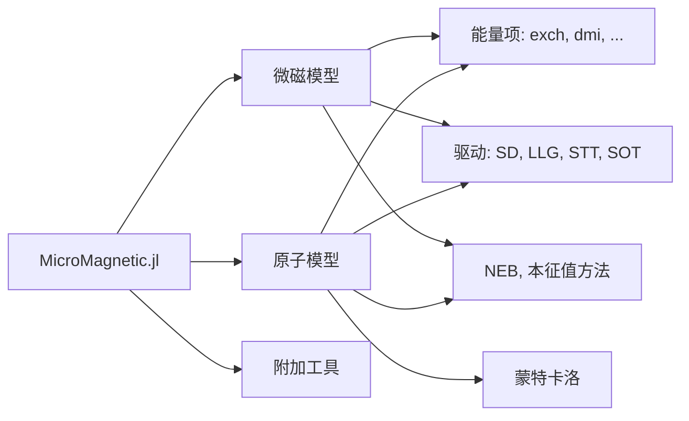

```@raw html
---
# https://vitepress.dev/reference/default-theme-home-page
layout: home

hero:
  name: "MicroMagnetic.jl"
  tagline: 支持 GPU 的经典自旋动力学与微磁学模拟 Julia 软件包。
  image: 
    src: /logo.png
    alt: MicroMagnetic
  actions:
    - theme: brand
      text: 快速上手
      link: /basics
    - theme: alt
      text: API
      link: https://magneticsimulation.github.io/MicroMagnetic.jl/dev/api
    - theme: alt
      text: GitHub 仓库
      link: https://github.com/MagneticSimulation/MicroMagnetic.jl

features:
  - icon: 
    title: 标准问题 4
    details: 使用 sim_with 模拟标准问题 4
    link: https://magneticsimulation.github.io/MicroMagnetic.jl/dev/micromagnetics/std4_sim_with
  - icon: 
    title: 标准问题 5
    details: 自旋转移矩驱动下的涡旋动力学
    link: https://magneticsimulation.github.io/MicroMagnetic.jl/dev/micromagnetics/std5
  - icon: 
    title: Stoner–Wohlfarth 模型
    details: 计算单轴颗粒的 Stoner–Wohlfarth 回线
    link: https://magneticsimulation.github.io/MicroMagnetic.jl/dev/micromagnetics/stoner_wohlfarth
  - icon: 
    title: 斯格明子相图
    details: 使用随机 LLG 计算斯格明子相图
    link: https://magneticsimulation.github.io/MicroMagnetic.jl/dev/atomistic/phase_diagram
  - icon: 
    title: 蒙特卡洛
    details: 使用蒙特卡洛方法计算 M-T 曲线
    link: https://magneticsimulation.github.io/MicroMagnetic.jl/dev/monte_carlo/M_T_curve
  - icon: 
    title: 动力学磁化率
    details: 计算纳米条的动力学磁化率
    link: https://magneticsimulation.github.io/MicroMagnetic.jl/dev/micromagnetics/chi


---

```

````@raw html
<p style="margin-bottom:2cm"></p>

<div class="vp-doc" style="width:80%; margin:auto">

<h1> 特性 </h1>
<ul>
  <li>支持经典自旋动力学与微磁学模拟。</li>
  <li>提供交互式网页 GUI，可实时可视化磁化动力学过程。</li>
  <li>兼容 CPU 与多种 GPU 平台，包括 NVIDIA、AMD、Intel 和 Apple GPU。</li>
  <li>同时支持双精度与单精度计算。</li>
  <li>支持原子模型的蒙特卡洛模拟。</li>
  <li>实现了用于计算能量势垒的 NEB（弹性带）方法。</li>
  <li>支持自旋转移矩，包括 Zhang-Li 与 Slonczewski 模型。</li>
  <li>内置多种能量项与热涨落。</li>
  <li>支持构造实体几何（CSG）。</li>
  <li>支持周期性边界条件。</li>
  <li>易于扩展以添加新功能。</li>
</ul>

<h2> 快速上手 —— 标准问题 4 </h2>

```julia
using MicroMagnetic
using CairoMakie

@using_gpu() # 导入可用的 GPU 软件包，如 CUDA、AMDGPU、oneAPI 或 Metal

mesh = FDMesh(; nx=200, ny=50, nz=1, dx=2.5e-9, dy=2.5e-9, dz=3e-9); # 定义离散化网格

sim = Sim(mesh; driver="SD", name="std4") # 创建模拟实例
set_Ms(sim, 8e5)        # 设置饱和磁化强度
add_exch(sim, 1.3e-11)  # 添加交换相互作用
add_demag(sim)          # 添加退磁场能

init_m0(sim, (1, 0.25, 0.1))  # 初始化磁化
relax(sim; stopping_dmdt=0.01)  # 第一步：弛豫得到 "S" 态

set_driver(sim; driver="LLG", alpha=0.02, gamma=2.211e5)
add_zeeman(sim, (-24.6mT, 4.3mT, 0))                # 第二步：施加外磁场
run_sim(sim; steps=100, dt=1e-11, save_m_every=1)   # 运行 100 步动力学模拟

ovf2movie("std4_LLG"; output="std4.mp4", component='x'); # 生成动画
```

<h2> MicroMagnetic.jl 的结构 </h2>



</div>
````
