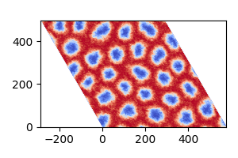

```@meta
ShareDefaultModule = true
```

# 用蒙特卡洛模拟斯格明子相

本例用蒙特卡洛方法模拟磁性斯格明子相。
体系参数取自论文：

- "Very large Dzyaloshinskii-Moriya interaction in two-dimensional Janus manganese dichalcogenides and its application to realize skyrmion states,"
  *Physical Review B*, vol. 101, p. 184401 (2020)。

这里复现论文图 4 中 MnSTe 的斯格明子相，
模拟温度为 10K，外磁场 1.5T。

````@example
using MicroMagnetic
using NPZ

@using_gpu()  # 若可用则启用 GPU 加速。
````

计算斯格明子相的弛豫函数。

````@example
function relax_system(; Hz = 0.1)
    #创建 x、y 方向带周期边界条件的三角网格。
    mesh = TriangularMesh(nx = 160, ny = 160, pbc = "xy")

    #初始化蒙特卡洛模拟对象。
    sim = MonteCarlo(mesh; name = "mc")

    #以随机取向设置初始磁化。
    init_m0_random(sim)

    #添加模拟参数：
    #交换相互作用。
    add_exch(sim; J = 10.52 * meV)

    #Dzyaloshinskii-Moriya 相互作用（DMI）。
    add_dmi(sim; D = 2.63 * meV, type = "interfacial")

    #与外场 Hz 相关的 Zeeman 相互作用。
    mu_s = 3.64 * mu_B  # 每个自旋的磁矩。
    add_zeeman(sim; Hz = Hz * mu_s)

    #单轴各向异性。
    add_anis(sim; Ku = 0.29 * meV)

    #高温退火以制备体系。
    Ts = [100000, 1000, 500]  # 退火温度（单位 K）。
    for T in Ts
        sim.T = T
        run_sim(sim; max_steps = 10_000, save_vtk_every = -1, save_m_every = -1)
    end

    #逐步降温到目标温度 10K。
    for T in 100:-10:10
        sim.T = T
        run_sim(sim; max_steps = 50_000, save_vtk_every = -1, save_m_every = -1)
    end

    #保存最终结果。
    save_vtk(sim, "final.vts")                  # 磁化保存为 VTK 文件。
    npzwrite("final_m.npy", Array(sim.spin))    # 磁化保存为 NumPy 文件。
end
````

以外磁场 1.5T 运行模拟。

```julia
relax_system(Hz = 1.5)
```

最终磁化数据保存在 "final.vts" 和 "final_m.npy" 中。
可以用 ParaView 或 Python 可视化结果。下面是一个 Python 脚本示例：

```python
import numpy as np
import matplotlib.pyplot as plt
from matplotlib.transforms import Affine2D

# 读取磁化数据。
m = np.load("final_m.npy")
m = np.reshape(m, (3, 160, 160), order='F')  # 重塑为 3x160x160 数组。

dx = 3.6

# 绘制磁化的 z 分量（m_z）。
fig, ax = plt.subplots(figsize=(3, 2))
im = ax.imshow(
    np.transpose(m[2, :, :]),
    extent=[0, 160 * dx, 0, 160 * dx * np.sqrt(3) / 2],
    origin='lower',
    cmap='coolwarm'
)

# 施加斜切变换以生成六边形可视化。
transform = Affine2D().skew_deg(-30, 0) + ax.transData
im.set_transform(transform)

# 调整 x 轴范围使可视化居中。
ax.set_xlim(-80 * dx, 160 * dx)

plt.tight_layout()
plt.savefig("final_m.png")
```

图像应如下所示：



